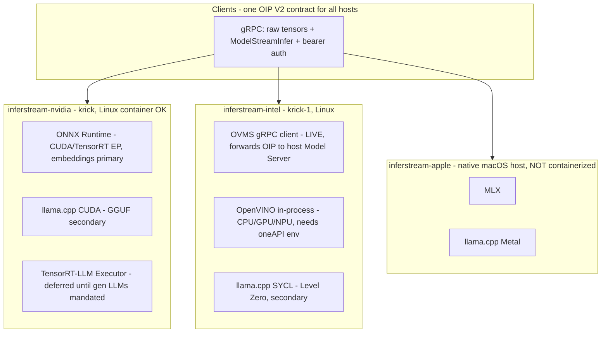

# inferstream

Lean, arch-specific **gRPC streaming inference / embedding servers** in Rust, sharing one wire contract: [KServe Open Inference Protocol (OIP) V2](https://github.com/kserve/open-inference-protocol) with raw byte tensors, bidirectional `ModelStreamInfer`, and bearer auth. Optimized for **raw latency and $/token** — a native, thread-safe alternative to DJL-style serving with no Java or Python hop between the socket and the engine.

One shared core (protocol, auth, routing), **three arch binaries**:

| binary | host class | engines | status |
|---|---|---|---|
| `inferstream-nvidia` | NVIDIA Linux (e.g. **krick**) | **ONNX Runtime + CUDA/TensorRT EP for embeddings** (primary), llama.cpp-CUDA (secondary, GGUF); TensorRT-LLM Executor **deferred** until generative LLMs are mandated (skeleton kept) | engine links stubbed; config + tensor contract final |
| `inferstream-intel` | Intel Linux (e.g. **krick-1**, Arc/Battlemage) | **OpenVINO** (primary): `ovms` gRPC client to the host's Model Server (**live — real GPU embeddings today**) + in-process runtime (stubbed); llama.cpp-SYCL (secondary, Docker-proven) | ovms client working; in-process links stubbed |
| `inferstream-apple` | **native macOS host** (Mac worker) | **MLX**, llama.cpp-Metal for GGUF | engine links stubbed; macOS-only by design; needs a Mac "My Machines" worker for real builds |
| `inferstream` | anywhere | mock only | fully working — dev/client-validation binary |

**Current honest status:** the façade is real — gRPC service, streaming, auth, routing, raw-tensor wire helpers, mock backend, and all three arch binaries build and run today (`cargo test --workspace` passes with zero GPU libraries). One real engine path is live: `inferstream-intel` with `backend = "ovms"` forwards typed OIP requests to the OpenVINO Model Server already running on krick-1 and returns real GPU embeddings (verified end-to-end: `minilm_pipeline` 384-dim / `mpnet_pipeline` 768-dim through the façade with bearer auth). Every *in-process* engine is still a stub: full config surface and OIP tensor contracts are in place, but no FFI links yet.

## Architecture



Shared plumbing lives in `crates/server` (service, auth interceptor, config, registry) behind a `BackendFactory` seam; each arch binary is a ~100-line factory that wires only its own engines. Nothing engine-specific leaks into the shared layer.

| Crate | Purpose |
|---|---|
| `crates/protocol` | Vendored OIP V2 proto + generated tonic types + raw tensor wire helpers |
| `crates/backend` | `Backend` trait, error types, model → backend `Registry` |
| `crates/backend-mock` | Deterministic mock (embeddings + chunked token streaming) — in every binary |
| `crates/backend-trtllm` | TensorRT-LLM **Executor** skeleton: config + OIP mapping (runtime link behind `trtllm-sys`) |
| `crates/backend-llamacpp` | llama.cpp for all flavors — device = `cuda` / `sycl` / `metal` / `vulkan` / `cpu` |
| `crates/backend-ort` | ONNX Runtime stub |
| `crates/backend-openvino` | OpenVINO in-process stub (Intel CPU/GPU/NPU) |
| `crates/backend-ovms` | **Working** OVMS/KServe gRPC client — forwards OIP requests to a running OpenVINO Model Server (typed protobuf, no JSON hop) |
| `crates/backend-apple` | MLX stub (`MlxBackend`) — functional only on macOS |
| `crates/server` | Shared: tonic service, auth, config, registry, CLI runner + mock-only `inferstream` bin |
| `crates/arch-nvidia` | `inferstream-nvidia` binary |
| `crates/arch-intel` | `inferstream-intel` binary |
| `crates/arch-apple` | `inferstream-apple` binary |

## Building each arch binary

Everything below builds on a plain Linux box today (engines are stubs); the extra host requirements kick in when the real engine links land.

```bash
# Dev / client validation (mock only) — anywhere
cargo run -p inferstream-server -- --config config/example.toml

# NVIDIA (krick): stub surface builds anywhere. Primary engine will be the
# ONNX Runtime CUDA/TensorRT execution provider (embeddings); the deferred
# TRT-LLM Executor link stays opt-in behind trtllm-sys (GPU host only).
cargo build -p inferstream-arch-nvidia --release
./target/release/inferstream-nvidia --config config/nvidia.toml

# Intel (krick-1): source oneAPI first (build shell AND service unit)
source /opt/intel/oneapi/setvars.sh
cargo build -p inferstream-arch-intel --release
./target/release/inferstream-intel --config config/intel.toml

# Apple: build and run ON THE MAC, never in a container
cargo build -p inferstream-arch-apple --release
./target/release/inferstream-apple --config config/apple.toml
```

Routing a model to an engine a binary doesn't ship fails **at startup** with the exact feature flag or the right binary named — never at request time.

## Why per-arch binaries (and why a façade at all)

- **Latency and $/token, not portability theater.** Each accelerator's peak path is a different runtime (TRT-LLM Executor vs Level Zero vs Metal/MLX). One fat binary linking all of them means compromise flags, giant images, and driver conflicts. Three lean binaries mean each host runs exactly its optimum and nothing else.
- **No Java/Python hop.** Unlike DJL (JVM) or Python servers, the socket-to-engine path is a single Rust process; streaming tokens don't cross an interpreter.
- **Not NIM.** NVIDIA NIM wraps engines in an OpenAI-style HTTP service. inferstream keeps engines in-process under its own gRPC (ORT EPs now; TRT-LLM Executor when generative LLMs are mandated). **NIM is used as a benchmark oracle only**: we run NIM beside `inferstream-nvidia` on the same GPU and model to sanity-check our tokens/sec and TTFT — if we're slower than the HTTP wrapper, that's a bug to fix, not a product to adopt.
- **Not OVMS/Triton/TEI.** Those own the process and the protocol; adding an engine or changing streaming/auth policy means forking C++ serving infrastructure. Here the protocol layer is ours, engines are leaf dependencies behind one trait — and clients speak the same OIP V2 they'd speak to Triton anyway. (krick-1 runs OVMS today; because it speaks the same OIP V2 family, `backend = "ovms"` forwards to it as a leaf engine while inferstream keeps auth/routing/streaming — and it doubles as the Intel-side benchmark oracle for the future in-process OpenVINO link.)

## Bake-off methodology (upcoming, per arch)

Metrics collected per engine/model/host, same client, same prompts:

| metric | definition |
|---|---|
| TTFT | request sent → first `ModelStreamInfer` chunk (p50/p95/p99) |
| ITL | inter-token latency between stream chunks (p50/p95) |
| tokens/sec | steady-state decode throughput, per stream and aggregate |
| embed p95 | unary `ModelInfer` latency for the embedding model |
| max concurrent streams | before p95 TTFT doubles |
| watts + $/1M tokens | wall power (or cloud $/hr) ÷ aggregate throughput |

Planned matchups:

- **krick (NVIDIA):** embeddings first — ORT CUDA EP vs ORT TensorRT EP vs llama.cpp-CUDA, with **NIM as oracle** where a comparable NIM exists. TRT-LLM Executor enters the generation matchup only once generative LLMs are mandated.
- **krick-1 (Intel Battlemage):** OpenVINO-GPU (primary; compare against the OVMS instance already on the host as oracle) vs llama.cpp-SYCL (Docker-proven), both via `inferstream-intel` — winner becomes the default `backend` in `config/intel.toml`; both stay compiled in, so switching is a config edit.
- **Mac:** MLX vs llama.cpp-Metal on the same GGUF/MLX model pair (needs the Mac "My Machines" worker for real builds).

Results land in `docs/bakeoff/` as they happen; no numbers are published until they come from these builds on this contract (no vendor-quoted numbers).

## Protocol notes

The proto is vendored at `crates/protocol/proto/open_inference_grpc.proto` from [kserve/open-inference-protocol](https://github.com/kserve/open-inference-protocol), pinned at commit `d49cc23f89d709d87b210ef9449e273ae243984e`.

Upstream OIP defines only unary `ModelInfer`. inferstream adds a clearly marked extension:

- `rpc ModelStreamInfer(stream ModelInferRequest) returns (stream ModelStreamInferResponse)` — the de-facto streaming shape established by NVIDIA Triton's `grpc_service.proto`, so existing streaming clients interoperate.
- Multiple requests can be multiplexed on one stream; every response chunk **echoes the request `id`** for correlation, and a backend may emit many chunks per request (one per generated token). Per-request failures are reported in `error_message` without tearing down the stream.
- `ServerMetadata.extensions` advertises `model_stream_infer`.

Raw tensor rules (helpers in `inferstream_protocol::tensor`):

- Fixed-size dtypes (`FP32`, `INT64`, …) are flat, row-major, **little-endian** byte blobs in `raw_input_contents` / `raw_output_contents`; blob length must equal `element_count(shape) * element_size`.
- `BYTES` elements are length-prefixed with a little-endian `u32`.
- `FP16` / `BF16` exist only in raw form — one more reason raw is the primary path.

Generation contract (all engines, identical to what the mock emits today): input `text` (BYTES) or `input_ids` (INT32); each stream chunk carries `token` (BYTES) and sets the bool parameter `final` on the terminal chunk. Embeddings: unary, output `embedding` FP32 `[d]`. Clients don't change between the mock and a GPU engine.

## Trying it now

```bash
cargo test --workspace          # passes with no GPU libs
cargo run -p inferstream-server -- --config config/example.toml
# in another shell — unary embed + two multiplexed bidi streams:
cargo run -p inferstream-server --example client -- http://127.0.0.1:8461
```

grpcurl works against any binary with the vendored proto:

```bash
grpcurl -plaintext -proto crates/protocol/proto/open_inference_grpc.proto \
  127.0.0.1:8461 inference.GRPCInferenceService/ServerLive

# Unary infer: "hi" as a length-prefixed BYTES tensor (base64 of 02 00 00 00 68 69)
grpcurl -plaintext -proto crates/protocol/proto/open_inference_grpc.proto \
  -d '{"model_name":"mock-embed","id":"r1","inputs":[{"name":"text","datatype":"BYTES","shape":[1]}],"raw_input_contents":["AgAAAGhp"]}' \
  127.0.0.1:8461 inference.GRPCInferenceService/ModelInfer
```

## Auth

Static **bearer tokens (API keys)** enforced by a tonic interceptor on every RPC, on every binary:

```toml
[auth]
mode = "bearer"
bearer_tokens = ["change-me"]     # and/or the env var below
```

```bash
INFERSTREAM_API_KEYS="key-a,key-b" ./target/release/inferstream-nvidia --config config/nvidia.toml
```

Clients send gRPC metadata `authorization: Bearer <key>` (`grpcurl -H 'authorization: Bearer key-a' …`). Comparison is constant-time per candidate. Bearer keys need an encrypted transport: TLS/mTLS is the next auth step — tonic's `ServerTlsConfig` (with `client_ca_root` for mTLS) slots into `serve()` in `crates/server/src/lib.rs` without touching the service layer. Until then terminate TLS in front or stay on trusted networks. No quotas by design.

## Deployment: Apple hosts vs Linux containers

NVIDIA CUDA passes into Linux containers via the NVIDIA container toolkit. **Apple GPU (Metal) and the Neural Engine do not** — there is no macOS container GPU passthrough, and Linux containers on a Mac run inside a VM without Metal. Therefore:

- `inferstream-nvidia` and `inferstream-intel` deploy as Linux containers (or bare processes) on their GPU hosts.
- `inferstream-apple` deploys **natively on the Mac** (launchd service or plain process). It compiles on Linux as a stub so CI type-checks the wiring, but it only functions on macOS.

Same client, same contract, heterogeneous fleet: krick (NVIDIA) + krick-1 (Intel) + Mac workers behind one OIP endpoint shape.

## Roadmap

1. **ONNX Runtime session wiring** (`backend-ort`) with the CUDA / TensorRT execution providers — krick's primary embedding path.
2. ~~**OVMS client backend**~~ — **done**: `backend = "ovms"` serves real Battlemage-GPU embeddings on krick-1 through the façade today (see `config/intel.toml` and `crates/arch-intel/examples/ovms_embed.rs`).
3. **OpenVINO runtime link** (`backend-openvino`) — krick-1's in-process path (the live OVMS route as oracle); llama.cpp-SYCL as the Docker-proven secondary.
4. **llama.cpp FFI** (`backend-llamacpp`) — one binding, all devices (CUDA secondary on krick, SYCL secondary on krick-1, Metal on Mac).
5. **MLX** (`backend-apple`) via `mlx-rs` — needs the Mac "My Machines" worker for real builds.
6. **TRT-LLM Executor FFI** (`backend-trtllm`, feature `trtllm-sys`) — deferred until generative LLMs are mandated; skeleton and tensor contract stay ready.
7. **TLS / mTLS** in `serve()`; per-key model ACLs after.
8. Optional adapters: TEI-compatible proto (lowest priority), shared-memory tensor hints, richer stream metadata.

Out of scope: dual independent pub/sub subscribe streams ("Surface 1") — request-scoped bidi only. No NIM HTTP wrapping, ever.

## License

[Apache-2.0](LICENSE). Contributions welcome — see [CONTRIBUTING.md](CONTRIBUTING.md).
