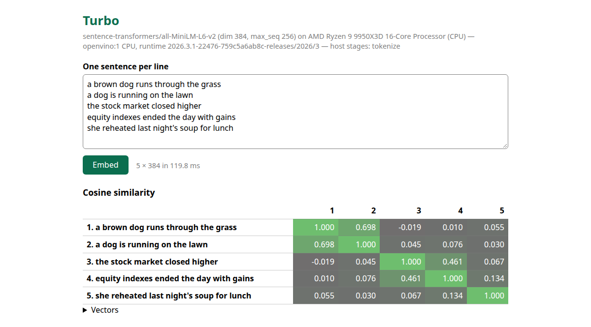
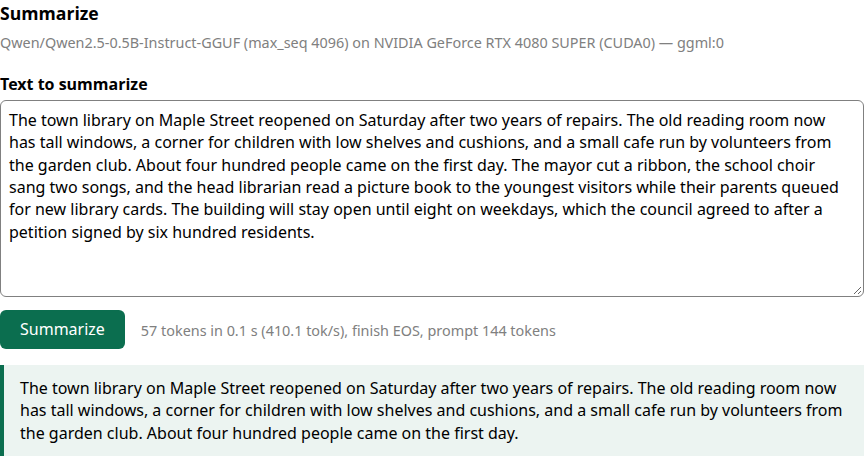

# Turbo

Turbo is one native library for embeddings and inference on whatever
accelerator a machine has: a single C ABI (`libturbo`, `turbo_` prefix), a
safe Rust API on top, Java and Swift bindings, and hardware support as
provider libraries loaded at runtime rather than compile-time flags. The
same program embeds on an NVIDIA GPU, an Intel GPU or CPU through OpenVINO,
a Hailo-8 NPU on a Raspberry Pi, a Jetson, or an Apple M2 through Metal
directly, and generates text from GGUF models through llama.cpp, without
changing a line.

Its rules are simple and enforced: every option is honored exactly or the
call fails naming the field; a device is never silently swapped for a
slower one; every claim about precision or speed comes with a committed
receipt from a named machine; and a model's contract (pooling,
normalization, limits, prefixes) is frozen in a hash-verified bundle.



The same app streams a summary from a GGUF model through the ggml
provider (Qwen2.5-0.5B on an RTX 4080 SUPER here, 297 tokens/s; a 0.5B
model summarizes by trimming, which the screenshot shows as it is):



## Quick start

```sh
cargo build -p turbo-shared -p turbo-bench          # libturbo.so and the survey/benchmark tool
target/debug/turbo-bench discover                   # what this machine can run (built-in providers)
target/debug/turbo-bench discover --provider-dir build/openvino --provider-lib target/debug/libturbo_provider_cuda.so \
    --bundle ~/opt/bundles/minilm-onnx              # every device, its features, and whether it can run the bundle

make -C demo/c test                                 # C: embed three sentences on the mock bundle
demo/java-web-spring/run.sh --turbo.bundle=~/opt/bundles/minilm-onnx \
    --turbo.provider-lib=build/openvino/libturbo_provider_openvino.so --turbo.provider=openvino --turbo.ordinal=1
```

`turbo-bench discover` prints, per device, the provider and runtime
versions, the option features it honors, the task-by-modality capability
matrix with its compute dtype and measured cosine floor, and, for each
bundle named, whether the device can run it and why not.

## What it does

| task | what you get |
|---|---|
| `EMBED` | dense vectors with the bundle's pooling and normalization, on the device |
| `RERANK` | cross-encoder scores, optionally sorted, optionally raw logits |
| `CLASSIFY`, `TOKEN_CLASSIFY` | labels with activations, and word-aligned entity spans |
| `GENERATE` | a pull iterator over chunks (and a push form), with chat templates, stop strings and tokens, seeds, logprobs, grammars, cancellation from any thread |
| `TOKENIZE` | the bundle's tokenizer as a thread-safe object: encode into caller rows, decode, count |

One object model for every provider:

```
turbo_runtime -> turbo_device -> turbo_context -> turbo_model -> turbo_session -> turbo_result
                                                             \-> turbo_generation
                    turbo_tokenizer (from a bundle)
```

Every option a caller can pass maps to a `TURBO_CAP_*` bit. A provider
either honors it exactly or the call fails with
`TURBO_E_UNSUPPORTED_OPTION` and the 1-based field index. Device selection
with `AUTO` never picks a CPU; a CPU is an explicit choice.

## Hardware

Providers are separate libraries (`libturbo_provider_<name>`) exporting one
symbol, `turbo_provider_get`. Status is per (device, task, modality) cell
and comes from committed receipts under `testdata/receipts/turbo/`.

| provider | devices with receipts | runtime | status |
|---|---|---|---|
| `cuda` | RTX 4080 SUPER (`krick`), Jetson Orin Nano (`nano1`) | ONNX Runtime CUDA EP, own pooling and activation kernels | SUPPORTED for embeddings on the 4080 (1.04x to 2.64x the ONNX Runtime CUDA loop, `compare-cuda-krick-embed-2026-09-22.json`); EXPERIMENTAL elsewhere; cosine 1.000 vs FP32 |
| `openvino` | Battlemage B70 (`krick-1`), any CPU | OpenVINO 2026.3, fused graph, `cl_mem` results on GPU | SUPPORTED for embeddings on the B70 (1.15x to 1.55x the OpenVINO C++ loop) and on the Ryzen 9 CPU (1.01x to 1.34x); cosine 1.000 vs FP32 |
| `ggml` | RTX 4080 SUPER and CPU (`krick`), Apple M2 Metal (`krickert-mac`) | llama.cpp through `llama-cpp-2` | SUPPORTED on the 4080 for generation (0.99x of llama.cpp itself) and GGUF embeddings (0.99x to 1.89x) |
| `metal` | Apple M2 (`krickert-mac`) | Metal directly: MSL kernels compiled at load, shared `MTLBuffer`s end to end, no MLX | SUPPORTED for embeddings on the M2 (1.00x of the kernels run directly); EXPERIMENTAL for rerank; cosine 1.000 vs FP32 |
| `hailo` | Hailo-8 on two Raspberry Pis (`pi5ai1`, `cm5ai1`) | HailoRT 4.23 vstreams, INT8 HEF | SUPPORTED for embeddings on the Hailo-8 (1.00x of `hailortcli benchmark`); cosine floor 0.45 vs FP32, ranking at parity (Spearman 0.937 vs 0.944) |
| `static` | any CPU, explicit only | model2vec-style table lookup | EXPERIMENTAL |
| `mock` | two synthetic devices | none | for contract tests only, never a real model |

`SUPPORTED` is earned per (device, task) by a matched-native benchmark on
top of the conformance and precision receipts: `crates/turbo-bench`
measures the `libturbo` side, the programs under [`reference/`](reference/README.md)
drive each runtime alone on the same token rows, and `turbo-bench
compare` writes the verdict (every cell at 0.95 of native or better) into
`testdata/receipts/turbo/bench/compare-*.json`. Hailo-10H is planned; see
[`PLAN.md`](PLAN.md). The web demo's Benchmarks panel renders those receipts,
so the same comparison can be read per device in a browser
([`demo/java-web-spring`](demo/java-web-spring/README.md#benchmarks)).


## Bindings and demos

| language | where | notes |
|---|---|---|
| C, C++ | `include/turbo/turbo.h` | the ABI everything else sits on; struct sizes are versioned |
| Rust | `crates/turbo` | safe API; lifetimes enforced by types |
| Java 25 | `bindings/java` (`ai.pipestream:turbo`) | FFM, generated by jextract; embed, rerank, classify, generate, tokenize |
| Swift | `bindings/swift` (`PipestreamTurbo`) | SwiftPM over a clang module of the header |
| Python | `demo/python` | `ctypes` over the C ABI, no extension module |
| Android | `demo/android` | a JNI shim over the C ABI (FFM is not on Android) |

`server/` is Inferstream, the inference server: the KServe Open Inference
Protocol v2 over gRPC (with reflection) and REST, an extension service
that streams generation and loads or unloads bundles while the server
runs, the OpenAI-shaped `/v1/embeddings`, `/v1/rerank`,
`/v1/chat/completions` (streaming) and `/v1/classify`, and `/info`, over
any served bundle with pooled fixed-shape sessions. It ships as a
container image with KServe manifests (`packaging/`), and `demo/rag/`
runs embed, rerank and a cited streamed answer over it through the
OpenAI SDK and through KServe's own clients, and `demo/search/` is a
page it serves that searches 48 passages in 8 languages with MiniLM and
Qwen3-Embedding-0.6B side by side. See
[`server/README.md`](server/README.md).

`demo/` holds a small program per language that embeds sentences and
prints their similarities, a C summarizer that streams from a GGUF model
through the push generation API, a gRPC C++ server, and a Spring Boot web
app with the page above and a streaming summarizer; `demo/run-all.sh` runs
every one this machine can on the mock bundles. See
[`demo/README.md`](demo/README.md).

## Models

A model is a bundle directory: `bundle.json` freezes the contract (task,
pooling, normalization, `max_seq`, dimension, prefixes, labels, tokenizer
identity) and hashes every artifact (`onnx`, `openvino_ir`, `gguf`, `hef`
plus `hailo_tables`). `turbo-bundle import` builds one from a Hugging Face
or sentence-transformers directory and refuses what it cannot verify. See
[`docs/bundles.md`](docs/bundles.md).

## Build and test

```sh
cargo test --workspace --exclude turbo-provider-cuda   # unit tests and the provider-agnostic conformance suite (mock)
scripts/gen-header.sh --check && scripts/gen-versioned.py --check && scripts/gen-unicode-nfd.py --check
cd bindings/java && mvn test                          # 16 cases under --illegal-native-access=deny
cd bindings/swift && swift run turbo-conformance       # macOS, 16 cases
make -C providers/metal test                          # macOS, the Metal provider and its 15 vtable cases
scripts/package.sh                                    # the archive for this machine, verified by ldd, a C smoke test, and a provider load check
scripts/package-container.sh                          # the same archive on the manylinux_2_28 floor
```

Live suites run against real providers and bundles through environment
variables (`TURBO_LIVE_LIB`, `TURBO_LIVE_PROVIDER`, `TURBO_LIVE_BUNDLE`);
every receipt in `testdata/receipts/turbo/` records one such run. See
[`docs/testing.md`](docs/testing.md).

## Repository

```
include/turbo/      the generated, committed C headers
crates/             turbo-abi, turbo-core, turbo-capi, turbo (safe API), turbo-conformance, turbo-bench
providers/          mock, static, cuda, ggml (Rust); openvino, hailo (C++); metal (Objective-C++)
native/             the shared C++ WordPiece tokenizer and provider helpers
bindings/           java (FFM), swift
server/             Inferstream (turbo-inferstream): OIP v2 gRPC and REST, extension service, OpenAI-shaped routes
packaging/          the distribution archive Dockerfile, the Inferstream image, KServe manifests
demo/               c, python, rust, java, swift, grpc-c-server, android, java-web-spring, rag, search
tools/turbo-bundle  bundle import, verify, inspect
scripts/            header and size-table generators, packaging, table export
testdata/           mock bundles, reference vectors, corpora, receipts
docs/               architecture, C API, bundles, providers, testing, packaging, bindings, reviews, status
```

## Documentation

- [`PLAN.md`](PLAN.md): the design, its principles, the milestones and their status.
- [`docs/status.md`](docs/status.md): the long-form account of what has landed, per machine.
- [`docs/architecture.md`](docs/architecture.md), [`docs/c-api.md`](docs/c-api.md), [`docs/providers.md`](docs/providers.md), [`docs/bundles.md`](docs/bundles.md), [`docs/bindings.md`](docs/bindings.md), [`docs/packaging.md`](docs/packaging.md), [`docs/testing.md`](docs/testing.md).
- [`docs/reviews/`](docs/reviews/): the independent reviews and how each finding was closed.
- [`AGENTS.md`](AGENTS.md): the rules for contributors, human or otherwise.

## License

Apache-2.0. See [`LICENSE`](LICENSE).
