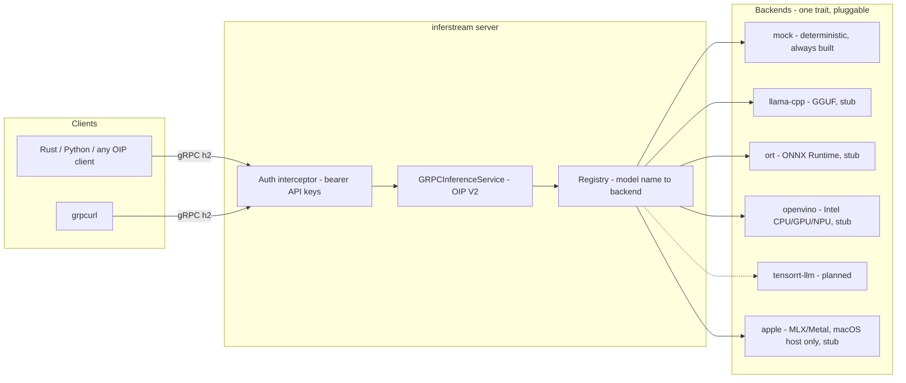

# inferstream

A thin, multi-backend **gRPC streaming inference / embedding server façade** in Rust.

inferstream speaks the [KServe Open Inference Protocol (OIP) V2](https://github.com/kserve/open-inference-protocol) over gRPC — `ServerLive`, `ServerReady`, `ModelReady`, `ModelMetadata`, unary `ModelInfer`, and bidirectional-streaming `ModelStreamInfer` — and routes each model to a pluggable backend (llama.cpp, ONNX Runtime, OpenVINO, TensorRT-LLM, Apple MLX/Metal). Tensor payloads travel as **raw little-endian bytes** (`raw_input_contents` / `raw_output_contents`) with dtype/shape metadata, not as repeated scalar fields.

**v0.1 status:** solid protocol skeleton + deterministic mock backend, bearer-token auth, model routing config, integration-tested unary and bidi round-trips. Engine backends are compile-gated stubs with defined crate boundaries.

## Architecture



Crate layout:

| Crate | Purpose |
|---|---|
| `crates/protocol` | Vendored OIP V2 proto + generated tonic types + raw tensor wire helpers |
| `crates/backend` | `Backend` trait, error types, model → backend `Registry` |
| `crates/backend-mock` | Deterministic mock backend (embeddings + chunked token streaming) |
| `crates/backend-llamacpp` | llama.cpp stub (feature `llamacpp`) |
| `crates/backend-ort` | ONNX Runtime stub (feature `ort`) |
| `crates/backend-openvino` | OpenVINO stub (feature `openvino`) |
| `crates/backend-apple` | Apple MLX/Metal stub (feature `apple`, macOS host only) |
| `crates/server` | tonic server, auth interceptor, config, CLI, examples, integration tests |

## Why a façade (vs OVMS / TEI / Triton / DJL)

- **OpenVINO Model Server / Triton** are excellent engines-with-servers, but they own the process and the protocol surface; adding a new engine (llama.cpp, MLX) or a custom auth/streaming policy means forking C++ serving infrastructure. inferstream inverts that: the **protocol layer is the product**, engines are leaf dependencies behind one Rust trait.
- **TEI (text-embeddings-inference)** is embedding-specific with its own proto. inferstream speaks the vendor-neutral OIP V2 that KServe, Triton, and OVMS clients already understand; a TEI-compatible adapter is a possible later addition, lowest priority.
- **DJL** is a JVM model-serving framework. inferstream deliberately is not a framework: no Python or JVM in the hot path, no model zoo, no training — a tokio/tonic binary that routes tensors.
- One wire surface across heterogeneous hardware: the same client code hits a CUDA Linux box, an Intel NPU box, or a Mac serving via MLX.

## Protocol notes

The proto is vendored at `crates/protocol/proto/open_inference_grpc.proto` from [kserve/open-inference-protocol](https://github.com/kserve/open-inference-protocol), pinned at commit `d49cc23f89d709d87b210ef9449e273ae243984e`.

Upstream OIP defines only unary `ModelInfer`. inferstream adds a clearly marked extension:

- `rpc ModelStreamInfer(stream ModelInferRequest) returns (stream ModelStreamInferResponse)` — the de-facto streaming shape established by NVIDIA Triton's `grpc_service.proto`, so existing streaming clients interoperate.
- Multiple requests can be multiplexed on one stream; every response chunk **echoes the request `id`** for correlation, and a backend may emit many chunks per request (one per generated token). Per-request failures are reported in `error_message` without tearing down the stream.
- `ServerMetadata.extensions` advertises `model_stream_infer`.

Raw tensor rules (helpers in `inferstream_protocol::tensor`):

- Fixed-size dtypes (`FP32`, `INT64`, …) are flat, row-major, **little-endian** byte blobs; blob length must equal `element_count(shape) * element_size`.
- `BYTES` elements are length-prefixed with a little-endian `u32`.
- `FP16` / `BF16` exist only in raw form (no repeated scalar field), which is one more reason the raw path is the primary path.

## Running locally

Requires Rust ≥ 1.85 and `protoc` (e.g. `apt install protobuf-compiler` or a [release binary](https://github.com/protocolbuffers/protobuf/releases)).

```bash
# Start the server with the example config (mock models, no auth, port 8461)
cargo run -p inferstream-server -- --config config/example.toml
```

Hit it with the bundled example client (unary embedding + bidi token stream):

```bash
cargo run -p inferstream-server --example client -- http://127.0.0.1:8461
```

Or with grpcurl, using the vendored proto:

```bash
grpcurl -plaintext -proto crates/protocol/proto/open_inference_grpc.proto \
  127.0.0.1:8461 inference.GRPCInferenceService/ServerLive

grpcurl -plaintext -proto crates/protocol/proto/open_inference_grpc.proto \
  -d '{"name": "mock-embed"}' \
  127.0.0.1:8461 inference.GRPCInferenceService/ModelMetadata

# Unary infer: "hi" as a length-prefixed BYTES tensor
# (raw_input_contents is base64 in grpcurl's JSON encoding: 02 00 00 00 68 69)
grpcurl -plaintext -proto crates/protocol/proto/open_inference_grpc.proto \
  -d '{"model_name":"mock-embed","id":"r1","inputs":[{"name":"text","datatype":"BYTES","shape":[1]}],"raw_input_contents":["AgAAAGhp"]}' \
  127.0.0.1:8461 inference.GRPCInferenceService/ModelInfer
```

Run the test suite (default features — no engine or Apple deps):

```bash
cargo test --workspace
```

## Auth

v0.1 ships static **bearer tokens (API keys)** enforced by a tonic interceptor on every RPC:

```toml
[auth]
mode = "bearer"
bearer_tokens = ["dev-key-change-me"]   # and/or use the env var below
```

Prefer supplying keys via environment so they stay out of config files:

```bash
INFERSTREAM_API_KEYS="key-a,key-b" cargo run -p inferstream-server -- --config config/example.toml
```

Clients send standard gRPC metadata: `authorization: Bearer <key>` (see `crates/server/examples/client.rs`, or `grpcurl -H 'authorization: Bearer key-a' …`). Token comparison is constant-time per candidate.

Bearer tokens are only meaningful over an encrypted transport. TLS/mTLS is the designated next auth step: tonic's `ServerTlsConfig` (with `client_ca_root` for mTLS) slots into `serve()` in `crates/server/src/lib.rs` without touching the service layer; until then, terminate TLS in front (or stay on localhost/private networks). No quotas or rate limits in v0.1 by design.

## Deployment: Apple hosts vs Linux containers

NVIDIA CUDA passes into Linux containers via the NVIDIA container toolkit. **Apple GPU (Metal) and the Apple Neural Engine do not** — there is no macOS container GPU passthrough, and Linux containers on a Mac run inside a VM without Metal. Therefore:

- **Linux containers** serve the llama.cpp (CUDA/Vulkan/CPU), ONNX Runtime, OpenVINO, and TensorRT-LLM backends.
- **The Apple backend runs natively on a macOS host** (Mac server or Mac worker node) — same binary, same gRPC surface, built with `--features apple` on macOS.
- Linux CI builds default features only and never needs Apple frameworks; the `apple` crate compiles everywhere but is only expected to function on macOS.

A typical fleet is heterogeneous: Linux GPU boxes + Mac minis behind the same OIP endpoint contract.

## Configuration

Model → backend routing lives in TOML (`config/example.toml`):

```toml
listen = "127.0.0.1:8461"

[[models]]
name = "mock-embed"
backend = "mock"

[[models]]
name = "nomic-embed-text"
backend = "llama-cpp"          # requires: cargo build --features llamacpp
path = "/models/nomic-embed-text-v1.5.Q8_0.gguf"
```

Routing a model to a backend that was not compiled in fails **at startup** with the feature flag to enable — never at request time.

## Roadmap

1. **llama.cpp** (`backend-llamacpp`) — primary engine: GGUF embeddings (unary `FP32` tensor) and token generation (`infer_stream`, one `BYTES` chunk per token, `final` flag on the last). Portable CUDA / Metal / Vulkan / CPU.
2. **ONNX Runtime** (`backend-ort`) — session-per-model via the `ort` crate; execution providers by config.
3. **OpenVINO** (`backend-openvino`) — Intel CPU/GPU/NPU device selection; a backend, not an OVMS dependency.
4. **TensorRT-LLM** — later NVIDIA peak-throughput path; interface reserved, no crate yet.
5. **Apple MLX / Metal** (`backend-apple`) — macOS-host-native embeddings and generation via MLX; Core ML / ANE offload as a follow-up.
6. **TLS / mTLS termination** in `serve()`; then per-key model ACLs.
7. Optional adapters: TEI-compatible proto (lowest priority), shared-memory tensor hints, richer stream metadata.

Out of scope for v0.1: dual independent pub/sub subscribe streams ("Surface 1") — only request-scoped bidi streaming is supported.

## License

[Apache-2.0](LICENSE). Contributions welcome — see [CONTRIBUTING.md](CONTRIBUTING.md).
