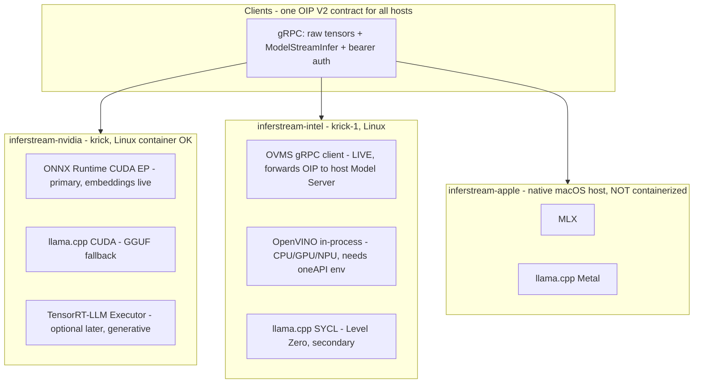

# inferstream

Lean, arch-specific **gRPC streaming inference / embedding servers** in Rust, sharing one wire contract: [KServe Open Inference Protocol (OIP) V2](https://github.com/kserve/open-inference-protocol) with raw byte tensors, bidirectional `ModelStreamInfer`, and bearer auth. Optimized for **raw latency and $/token** — a native, thread-safe alternative to DJL-style serving with no Java or Python hop between the socket and the engine.

One shared core (protocol, auth, routing), **three arch binaries**:

| binary | host class | engines | status |
|---|---|---|---|
| `inferstream-nvidia` | NVIDIA Linux (e.g. **krick**) | **ONNX Runtime CUDA EP** (primary — encoder embeddings) + **llama.cpp-CUDA** (GGUF generative token streaming, in-process), TensorRT-LLM Executor (optional later feature) | **ORT engine real** (`ort-runtime` / `ort-cuda`), validated on krick against TEI; **llama.cpp engine real in-process** (`llamacpp-runtime` / `llamacpp-cuda`, or `full-cuda` for both), streaming Qwen2.5-0.5B GGUF on krick; TRT-LLM link stubbed |
| `inferstream-intel` | Intel Linux (e.g. **krick-1**, Arc/Battlemage) | **OpenVINO** (primary): `ovms` gRPC client to the host's Model Server (**live — real GPU embeddings today**) + in-process runtime (stubbed); **llama.cpp-SYCL in-process** (`llamacpp-sycl`, Level Zero / Battlemage) for GGUF generation | ovms client live; llama.cpp SYCL in-process live (`default-llm` / `qwen-0.5b` / `qwen-7b`) |
| `inferstream-apple` | **native macOS host** (Mac worker) | **MLX** (primary — via persistent Python bridge on Metal: `mlx-embeddings` for embeddings, `mlx-lm` for generation), llama.cpp-Metal for GGUF (wired, unbuilt) | **MLX engine real** — Embed / Tokenize / Detokenize / `ModelStreamInfer` live on Metal via `python/mlx_bridge.py` (validated end-to-end with `scripts/smoke-apple.sh`); macOS-only by design, compiles as stub on Linux for CI |
| `inferstream` | anywhere | mock only | fully working — dev/client-validation binary |

## Per-arch gap status (honest)

Every arch binary serves **both** gRPC services on one port behind one bearer interceptor: the vendored OIP V2 `inference.GRPCInferenceService` and the `inferstream.v1.InferstreamService` extension (Tokenize / Detokenize / Embed / ListModels / Rerank). Registration lives in the shared `serve()` in `crates/server/src/lib.rs`, and all three binaries reach it through the same `run_cli` path — audited: none of them can start without exposing the extension service.

| capability | `inferstream-nvidia` | `inferstream-intel` | `inferstream-apple` |
|---|---|---|---|
| Embed (real accelerator) | **LIVE** — ORT CUDA EP (CPU EP anywhere), TEI-parity validated on krick | **LIVE** — `ovms` gRPC client to the host Model Server, Battlemage GPU verified on krick-1 | **LIVE** — MLX (`mlx-embeddings`) on Metal via the persistent Python bridge (`python/mlx_bridge.py`), verified end-to-end through the façade with `scripts/smoke-apple.sh` |
| Tokenize / Detokenize | **LIVE** — ORT engine's own HF tokenizer or `tokenizer_dir` server-side; GGUF models answer from the llama.cpp vocab (in-process) | **LIVE** — `tokenizer_dir` set for OVMS embed pipelines; GGUF models answer from the in-process llama.cpp vocab (no remote `/tokenize`) | **LIVE** — MLX models answer from the bridge's HF tokenizer on Metal (with `tokenizer_dir` as the engine-independent fallback), verified in the apple smoke run |
| Generative infer / stream | **LIVE** — llama.cpp-CUDA in-process (`llamacpp-cuda` / `full-cuda`) streams GGUF tokens over `ModelStreamInfer` (Qwen2.5-0.5B validated on krick); server-client mode (`endpoint`) also available; TRT-LLM (`trtllm-sys`) still a stub | **LIVE** — llama.cpp-SYCL **in-process** (`llamacpp-sycl`, GGML_SYCL=ON): unary `ModelInfer` + per-token `ModelStreamInfer` for `default-llm` / `qwen-0.5b` (Qwen2.5-0.5B Q8_0) and `qwen-7b` (Qwen2.5-7B-Instruct Q5_K_M, text — not VL). GPU-proven on krick-1 (`docs/intel-sycl-inprocess-krick-1.md`). Default aliases do **not** HTTP to `:8085`. OVMS still has no `ModelStreamInfer`; in-process OpenVINO is a stub | **LIVE** — MLX generation (`mlx-lm`) streams real per-token `ModelStreamInfer` chunks on Metal via the Python bridge; llama.cpp-Metal is wired (`metal` feature) but unbuilt on a Mac |
| `InferstreamService` registered in `serve()` | yes (shared) | yes (shared) | yes (shared) — binary compiles on Linux for CI, functions only on macOS |
| Rerank | mock scorer only | mock scorer only | mock scorer only |

### Apple MLX: merged and live

The Apple full-surface work is merged into `main`. `MlxBackend` (`crates/backend-apple`) talks to a **persistent Python worker** (`python/mlx_bridge.py`) over stdin/stdout — no per-request process spawn, no gRPC hop — running `mlx-embeddings` for embeddings and `mlx-lm` for streamed generation on the Metal device. Setup on a Mac is `scripts/setup-mlx.sh` (idempotent, uv-managed venv), and `scripts/smoke-apple.sh` exercises the full surface end-to-end through the façade (ListModels / Tokenize / Detokenize / Embed / ModelStreamInfer). Live Metal tests are gated behind the `mlx-live` feature (`cargo test -p inferstream-backend-apple --features mlx-live -- --ignored`) and stay `#[ignore]`d on Linux CI, where the crate still compiles and type-checks.

**Current honest status:** the façade is real — gRPC service, streaming, auth, routing, raw-tensor wire helpers, mock backend, and all three arch binaries build and run today (`cargo test --workspace` passes with zero GPU libraries). **Six real engine paths are live.** NVIDIA embeddings: `backend-ort` loads ONNX embedding models (BGE/MiniLM class) through the `ort` crate with server-side tokenization, mean/CLS pooling, and L2 normalization — CPU EP anywhere, CUDA EP on the GPU host — and its output matches TEI on the same model to fp32 tolerance. NVIDIA generation: `backend-llamacpp` in-process (features `llamacpp-runtime` / `llamacpp-cuda`) loads GGUF models through `llama-cpp-2`, streaming one `token` BYTES chunk per decoded piece over `ModelStreamInfer` with a `final` flag on the last chunk; unary `ModelInfer` returns the whole completion, and Tokenize/Detokenize answer from the GGUF vocabulary. Intel embeddings: `inferstream-intel` with `backend = "ovms"` forwards typed OIP requests to the OpenVINO Model Server already running on krick-1 and returns real GPU embeddings (verified end-to-end: `minilm_pipeline` 384-dim / `mpnet_pipeline` 768-dim through the façade with bearer auth). Intel generation: `backend = "llama-cpp"` with `endpoint` forwards to a running llama-server in server-client mode (krick-1: the GGML_SYCL `server-intel` container) — unary `ModelInfer`, per-token `ModelStreamInfer` chunks, and Tokenize/Detokenize, verified live (see `docs/intel-full-surface-krick-1.md`); the same mode works on any host, no engine link needed. Apple embeddings and generation: `backend-apple`'s `MlxBackend` drives a persistent `mlx_bridge.py` worker on the Metal device — `mlx-embeddings` for Embed, `mlx-lm` for per-token `ModelStreamInfer` streaming, and bridge-side HF Tokenize/Detokenize — validated end-to-end on Apple silicon with `scripts/smoke-apple.sh`. TRT-LLM and in-process OpenVINO remain stubs with full config surface; routing to them still fails at startup with the exact feature named. Beyond OIP, every binary now also serves the **`inferstream.v1` extension service** — Tokenize/Detokenize (server-side HF tokenizer), a typed `Embed` wrapper, `ListModels`, and a `Rerank` stub — documented below.

## Architecture



Shared plumbing lives in `crates/server` (service, auth interceptor, config, registry) behind a `BackendFactory` seam; each arch binary is a ~100-line factory that wires only its own engines. Nothing engine-specific leaks into the shared layer.

| Crate | Purpose |
|---|---|
| `crates/protocol` | Vendored OIP V2 proto + generated tonic types + raw tensor wire helpers |
| `crates/backend` | `Backend` trait, error types, model → backend `Registry` |
| `crates/backend-mock` | Deterministic mock (embeddings + chunked token streaming) — in every binary |
| `crates/backend-trtllm` | TensorRT-LLM **Executor** skeleton: config + OIP mapping (runtime link behind `trtllm-sys`) |
| `crates/backend-llamacpp` | llama.cpp for all flavors — device = `cuda` / `sycl` / `metal` / `vulkan` / `cpu` |
| `crates/backend-ort` | **ONNX Runtime embedding engine** (feature `runtime`; EPs: CPU / `cuda` / `tensorrt`) — tokenizes server-side, mean/CLS pooling + L2 norm; stub without the feature |
| `crates/backend-openvino` | OpenVINO in-process stub (Intel CPU/GPU/NPU) |
| `crates/backend-ovms` | **Working** OVMS/KServe gRPC client — forwards OIP requests to a running OpenVINO Model Server (typed protobuf, no JSON hop) |
| `crates/backend-apple` | **Working** MLX backend (`MlxBackend`) — persistent Python bridge to `mlx-embeddings` / `mlx-lm` on Metal; compiles as stub on Linux, functional only on macOS |
| `crates/server` | Shared: tonic service, auth, config, registry, CLI runner + mock-only `inferstream` bin |
| `crates/arch-nvidia` | `inferstream-nvidia` binary |
| `crates/arch-intel` | `inferstream-intel` binary |
| `crates/arch-apple` | `inferstream-apple` binary |

## Building each arch binary

Everything below builds on a plain Linux box today (engines are stubs); the extra host requirements kick in when the real engine links land.

```bash
# Dev / client validation (mock only) — anywhere
cargo run -p inferstream-server -- --config config/example.toml

# NVIDIA (krick): stub surface builds anywhere. The real embedding engine is
# ONNX Runtime — `ort`'s download-binaries fetches a matching libonnxruntime
# at build time, so no system ORT install is needed:
cargo build -p inferstream-arch-nvidia --release --features ort-runtime  # CPU EP, anywhere
cargo build -p inferstream-arch-nvidia --release --features ort-cuda     # CUDA EP, GPU host
# Full krick surface: ORT-CUDA embeddings + llama.cpp-CUDA GGUF generation.
# llama.cpp compiles from source with nvcc; when the host's default gcc is
# newer than nvcc supports, name a compatible host compiler:
CUDAHOSTCXX=/usr/bin/g++-13 CUDAARCHS=89 \
    cargo build -p inferstream-arch-nvidia --release --features full-cuda
cargo build -p inferstream-arch-nvidia --release --features trtllm-sys   # optional later: TRT-LLM
./target/release/inferstream-nvidia --config config/nvidia.toml
# See "NVIDIA GPU host requirements" below for the CUDA 13 runtime libs the
# ort-cuda build loads at startup.

# Intel (krick-1): stub surface builds anywhere. Real SYCL generation:
scripts/setup-llamacpp-sycl.sh          # inject ggml-sycl (crates.io omits it)
source /opt/intel/oneapi/setvars.sh     # build shell AND service unit
GGML_SYCL=ON CMAKE_C_COMPILER=icx CMAKE_CXX_COMPILER=icpx \
    cargo build -p inferstream-arch-intel --release --features llamacpp-sycl
make fetch-llms                         # SHA-256-pinned GGUF; no python3
scripts/run-intel.sh --config config/intel.toml

# Apple: build and run ON THE MAC, never in a container
cargo build -p inferstream-arch-apple --release
./target/release/inferstream-apple --config config/apple.toml
```

Routing a model to an engine a binary doesn't ship fails **at startup** with the exact feature flag or the right binary named — never at request time.

### NVIDIA GPU host requirements (ort-cuda)

The `ort` crate's prebuilt CUDA bundle (ONNX Runtime 1.28) is built against **CUDA 13**, so the CUDA EP needs at runtime:

- NVIDIA driver new enough for CUDA 13 (krick's 595.84 → CUDA 13.2: OK).
- CUDA 13 user-space runtime libs: `libcublasLt.so.13`, `libcublas.so.13`, `libcudart.so.13`, `libnvrtc.so.13`, and a cuDNN 9 built for CUDA 13. A CUDA **12** toolkit (krick's 12.4) does **not** satisfy this.

**Bundled route (recommended, no sudo)** — the repo scripts fetch pinned
NVIDIA pip wheels (~1.6 GB) into `.libs/nvidia/lib` and set the loader path
for you:

```bash
scripts/fetch-runtime-libs.sh nvidia          # once per host; pinned wheel versions
cargo build -p inferstream-arch-nvidia --release --features ort-cuda
scripts/run-nvidia.sh --config config/nvidia.toml   # sets LD_LIBRARY_PATH, execs the binary
```

Alternatives, if you prefer to manage the libs yourself:

```bash
# Manual pip wheels (what the script automates):
python3 -m venv .venv-cuda-libs
.venv-cuda-libs/bin/pip install --only-binary :all: \
    nvidia-cublas nvidia-cuda-runtime nvidia-cuda-nvrtc nvidia-cudnn-cu13
NV=$PWD/.venv-cuda-libs/lib/python3*/site-packages/nvidia
LD_LIBRARY_PATH=$NV/cu13/lib:$NV/cudnn/lib \
    ./target/release/inferstream-nvidia --config config/nvidia.toml

# With sudo — system install (NVIDIA apt repo):
sudo apt install cuda-runtime-13-2 libcudnn9-cuda-13
```

libonnxruntime itself is fetched at **build time** by `ort`'s
`download-binaries` feature, so no system ORT install is ever needed.

**Intel bundling:** nothing to fetch — `backend = "ovms"` is a pure
tonic/prost gRPC client to the OpenVINO Model Server already running on the
host; it links zero OpenVINO libraries (`scripts/fetch-runtime-libs.sh intel`
prints exactly this). Runtime libs for the in-process OpenVINO backend will
be added to the script when its FFI link lands.

EP registration uses `error_on_failure`: if these libs are missing the binary **fails at startup** with the loader's actual error instead of silently serving on CPU. `device = "tensorrt"` (build feature `ort-tensorrt`) additionally requires TensorRT 10 (`sudo apt install tensorrt-libs` from the NVIDIA repo) — not installed on krick today, so stay on `device = "cuda"`.

## Logical model names (alias catalog)

Clients address models by **logical name** — `model_name: "minilm"` works against all three arch binaries, and each host loads its own optimized artifact. Clients never learn whether that's an ORT CUDA session, an OVMS DAG pipeline, or an MLX model.

The catalog covers the popular embedding families and a small set of generative LLM aliases. An alias resolves only on arches with a **real** backend path (no fakes); `—` means unsupported there today, with the add-recipe documented in `config/catalog.toml`:

| alias | dims | `inferstream-nvidia` (ORT CUDA) | `inferstream-intel` (OVMS) | `inferstream-apple` (MLX) |
|---|---|---|---|---|
| `minilm` | 384 | TEI HF ONNX snapshot (on krick today) | → `minilm_pipeline` (live) | `mlx-community/all-MiniLM-L6-v2-4bit` (live) |
| `minilm-l12` | 384 | fetch† | → `minilm_l12_pipeline` | `sentence-transformers/all-MiniLM-L12-v2` |
| `mpnet` | 768 | fetch† | → `mpnet_pipeline` (live) | — (no MPNet in mlx-embeddings) |
| `bge-small` | 384 | fetch† | → `bge_small_pipeline` | `mlx-community/bge-small-en-v1.5-4bit` |
| `bge-base` | 768 | fetch† | → `bge_base_pipeline` | `BAAI/bge-base-en-v1.5` |
| `bge-large` | 1024 | fetch† | → `bge_large_pipeline` | `BAAI/bge-large-en-v1.5` |
| `bge-m3` | 1024 | fetch† | → `bge_m3_pipeline` | `BAAI/bge-m3` |
| `e5-small` | 384 | fetch† | → `e5_small_pipeline` | `intfloat/multilingual-e5-small` |
| `e5-base` | 768 | fetch† | → `e5_base_pipeline` | `intfloat/multilingual-e5-base` |
| `e5-large` | 1024 | fetch† | → `e5_large_pipeline` | `intfloat/multilingual-e5-large` |
| `gte-small` | 384 | fetch† | → `gte_small_pipeline` | `thenlper/gte-small` |
| `gte-base` | 768 | fetch† | → `gte_base_pipeline` | `thenlper/gte-base` |
| `nomic-embed-text` | 768 | fetch† (untested) | → `nomic_embed_text_pipeline` | — (no NomicBERT in mlx-embeddings) |

| alias | class | `inferstream-nvidia` (llama.cpp CUDA GGUF) | `inferstream-intel` (llama.cpp SYCL server-client) | `inferstream-apple` (mlx-lm) |
|---|---|---|---|---|
| `default-llm` | Qwen2.5-0.5B-Instruct | krick GGUF `/work/models/gguf/qwen2.5-0.5b-instruct-q8_0.gguf` (served) | fetch‡ `models/gguf/qwen-0.5b/` Q8_0 in-process SYCL (served) | `mlx-community/Qwen2.5-0.5B-Instruct-4bit` (served) |
| `qwen-0.5b` | Qwen2.5-0.5B-Instruct smoke | fetch‡ `models/gguf/qwen-0.5b/` Q8_0 | same fetched GGUF, in-process SYCL (served) | same MLX 4-bit as `default-llm` |
| `qwen-7b` | Qwen2.5-7B-Instruct (text) | fetch‡ official Q5_K_M shards (~5.1 GiB) | same fetched GGUF, in-process SYCL (served) | `mlx-community/Qwen2.5-7B-Instruct-4bit` |

† `make fetch-embeddings [ALIASES=alias1,alias2]` (or `scripts/fetch_models.py <alias> ...`) downloads a prebuilt ONNX export + tokenizer into `models/onnx/<alias>/` (the path the catalog's nvidia entries point at); then add the alias to `serve`. Every download is pinned to an exact HF revision and **SHA-256-verified** against the committed manifest `models/manifests/embeddings.json`.

‡ `make fetch-llms [ALIASES=qwen-0.5b,qwen-7b]` (`scripts/fetch-llms.sh` — curl + sha256sum, **no python3**) downloads the official Qwen GGUF + `tokenizer.json` into `models/gguf/<alias>/`, SHA-256-verified against `models/manifests/llms.json`. `default-llm` is `alias_of` `qwen-0.5b` (same files). Weights are **never** committed. See [`docs/fetching-models.md`](docs/fetching-models.md) for verify-only mode and per-arch coverage.

Apple entries download into the HF cache on first use through the MLX bridge (expected repos + revisions are recorded in each manifest's `mlx_repos` section). Tokenize for llama.cpp answers from the GGUF vocab in-process; apple LLM aliases need the fetched `tokenizer_dir`. Pooling follows each embedding family's convention (BGE = CLS, everything else mean); E5 models expect `query:` / `passage:` text prefixes from the client. Intel LLM aliases load the **matching** official Qwen GGUF on SYCL (0.5B Q8_0 / 7B-Instruct Q5_K_M) — not the VL-7B llama-server on `:8085`.

The mapping lives in the **catalog** (`config/catalog.toml`, compiled into every binary): one table per alias, one sub-table per arch with the same fields as a `[[models]]` entry, minus `name`. Arch configs opt in with a top-level `serve` list:

```toml
# defaults shipped today:
serve = ["minilm", …, "default-llm"]                    # nvidia (0.5B GGUF on krick)
serve = ["minilm", "mpnet", …, "default-llm", "qwen-0.5b", "qwen-7b"] # intel (OVMS + in-process SYCL)
serve = ["minilm", "minilm-l12", "bge-small", "default-llm", "qwen-0.5b"] # apple (0.5B MLX)
```

At startup each alias expands into a regular registry entry **named by the alias**, so `ListModels` and `ModelMetadata` report `minilm` (with the resolved backend and artifact in `backend` / `platform` / properties like `model_path` or `upstream_model`), and every RPC — `ModelInfer`, `ModelStreamInfer`, `Tokenize`, `Embed` — routes by it:

```bash
grpcurl -plaintext -proto crates/protocol/proto/inferstream_extension.proto \
  -H 'authorization: Bearer <key>' \
  -d '{"model_name":"minilm","texts":["hello world"]}' \
  <any-arch-host>:8461 inferstream.v1.InferstreamService/Embed
```

**Adding an alias:** add a `[models.<alias>]` table to `config/catalog.toml` with a `[models.<alias>.<arch>]` sub-table per arch that can serve it (arches: `nvidia`, `intel`, `apple`), rebuild, and list the alias in `serve`. For proxy backends (`ovms`) set `upstream_model` when the upstream pipeline name differs from the alias — requests are forwarded under the upstream name and responses report the logical one. To change resolutions per host **without rebuilding**, point the config at a catalog copy: `catalog = "/etc/inferstream/catalog.toml"`. The built-in matrix is enforced by a unit test (`BUILTIN_MATRIX` in `crates/server/src/catalog.rs`) — extend it when the catalog changes.

**Smoking the surface:** `scripts/smoke-embeddings.sh [host:port] [bearer-token] [model ...]` runs `ListModels` and then `Embed` through every serving model (or the subset you name), on any arch — exits nonzero if any model fails to return vectors. `scripts/smoke-llms.sh` does the same for generation aliases: `Tokenize` plus a short `ModelStreamInfer` (live GPU is the acceptance path; the script talks to an already-running server and does not download weights). Bring-up: `make fetch-embeddings` / `make fetch-llms` (hash-verified; `make verify-embeddings` / `make verify-llms` re-check offline) → extend `serve` → restart → smoke.

Failures are startup-time and actionable: an unknown alias lists what the catalog defines; an alias with no resolution for this arch names the arches that have one. Explicit `[[models]]` entries keep working alongside `serve` (collisions are rejected), and the arch-neutral dev `inferstream` binary rejects `serve` since it has no arch.

## Why per-arch binaries (and why a façade at all)

- **Latency and $/token, not portability theater.** Each accelerator's peak path is a different runtime (TRT-LLM Executor vs Level Zero vs Metal/MLX). One fat binary linking all of them means compromise flags, giant images, and driver conflicts. Three lean binaries mean each host runs exactly its optimum and nothing else.
- **No Java/Python hop.** Unlike DJL (JVM) or Python servers, the socket-to-engine path is a single Rust process; streaming tokens don't cross an interpreter.
- **Not NIM.** NVIDIA NIM wraps engines in an OpenAI-style HTTP service. inferstream keeps engines in-process under its own gRPC (ORT EPs now; TRT-LLM Executor when generative LLMs are mandated). **NIM is used as a benchmark oracle only**: we run NIM beside `inferstream-nvidia` on the same GPU and model to sanity-check our tokens/sec and TTFT — if we're slower than the HTTP wrapper, that's a bug to fix, not a product to adopt.
- **Not OVMS/Triton/TEI.** Those own the process and the protocol; adding an engine or changing streaming/auth policy means forking C++ serving infrastructure. Here the protocol layer is ours, engines are leaf dependencies behind one trait — and clients speak the same OIP V2 they'd speak to Triton anyway. (krick-1 runs OVMS today; because it speaks the same OIP V2 family, `backend = "ovms"` forwards to it as a leaf engine while inferstream keeps auth/routing/streaming — and it doubles as the Intel-side benchmark oracle for the future in-process OpenVINO link.)

## Bake-off methodology (upcoming, per arch)

Metrics collected per engine/model/host, same client, same prompts:

| metric | definition |
|---|---|
| TTFT | request sent → first `ModelStreamInfer` chunk (p50/p95/p99) |
| ITL | inter-token latency between stream chunks (p50/p95) |
| tokens/sec | steady-state decode throughput, per stream and aggregate |
| embed p95 | unary `ModelInfer` latency for the embedding model |
| max concurrent streams | before p95 TTFT doubles |
| watts + $/1M tokens | wall power (or cloud $/hr) ÷ aggregate throughput |

Planned matchups:

- **krick (NVIDIA):** embeddings first — ORT CUDA EP vs ORT TensorRT EP vs llama.cpp-CUDA, with **NIM as oracle** where a comparable NIM exists. TRT-LLM Executor enters the generation matchup only once generative LLMs are mandated.
- **krick-1 (Intel Battlemage):** OpenVINO-GPU (primary; compare against the OVMS instance already on the host as oracle) vs llama.cpp-SYCL (Docker-proven), both via `inferstream-intel` — winner becomes the default `backend` in `config/intel.toml`; both stay compiled in, so switching is a config edit.
- **Mac:** MLX vs llama.cpp-Metal on the same GGUF/MLX model pair (needs the Mac "My Machines" worker for real builds).

Results land in `docs/bakeoff/` as they happen; no numbers are published until they come from these builds on this contract (no vendor-quoted numbers).

## Protocol notes

The proto is vendored at `crates/protocol/proto/open_inference_grpc.proto` from [kserve/open-inference-protocol](https://github.com/kserve/open-inference-protocol), pinned at commit `d49cc23f89d709d87b210ef9449e273ae243984e`.

Upstream OIP defines only unary `ModelInfer`. inferstream adds a clearly marked extension:

- `rpc ModelStreamInfer(stream ModelInferRequest) returns (stream ModelStreamInferResponse)` — the de-facto streaming shape established by NVIDIA Triton's `grpc_service.proto`, so existing streaming clients interoperate.
- Multiple requests can be multiplexed on one stream; every response chunk **echoes the request `id`** for correlation, and a backend may emit many chunks per request (one per generated token). Per-request failures are reported in `error_message` without tearing down the stream.
- `ServerMetadata.extensions` advertises `model_stream_infer` and `inferstream.v1`.

## INFERSTREAM EXTENSION: `inferstream.v1.InferstreamService`

A second, clearly separated gRPC service (`crates/protocol/proto/inferstream_extension.proto`) runs on the same endpoint with the same bearer auth. The vendored OIP service is untouched — clients that only speak OIP lose nothing (every `Embed` is expressible as `ModelInfer` with a BYTES `text` tensor plus the `pooling` / `normalize` / `truncate` InferParameters).

| RPC | what it does |
|---|---|
| `Tokenize` | batch tokenization with the model's server-side tokenizer: `input_ids`, `attention_mask`, token strings, byte offsets on request, optional truncation and pad-to-longest |
| `Detokenize` | inverse of Tokenize; `skip_special_tokens` drops CLS/SEP/PAD frames |
| `Embed` | typed convenience wrapper over ModelInfer — send strings, get `float` vectors back; pooling/normalize/truncate forwarded as InferParameters |
| `ListModels` | one call for the whole repository: name, backend id, readiness, platform, embedding dim, tokenizer availability |
| `Rerank` | query/document relevance scores, sorted, with `top_n`; engines without a reranker answer `UNAVAILABLE` (the mock implements a deterministic scorer so the wire path tests everywhere) |

Tokenizer resolution: when a model's config sets `tokenizer_dir` (a `tokenizer.json` file or a directory containing one), the server loads a local HuggingFace fast tokenizer at startup and answers Tokenize/Detokenize itself — including for `backend = "ovms"` models whose upstream pipelines tokenize server-side on the Model Server. Without a configured tokenizer the request is delegated to the backend (the ORT engine reuses its own HF tokenizer; the mock ships a lossless byte-level tokenizer; everything else reports `UNAVAILABLE` with the config fix named).

grpcurl examples (mock server from `config/example.toml`):

```bash
PROTO="-proto crates/protocol/proto/inferstream_extension.proto"

# Repository listing: names, backends, readiness, dims
grpcurl -plaintext $PROTO 127.0.0.1:8461 inferstream.v1.InferstreamService/ListModels

# Batch tokenize with offsets and padding
grpcurl -plaintext $PROTO \
  -d '{"model_name":"mock-embed","texts":["hello world","hi"],"with_offsets":true,"pad_to_longest":true}' \
  127.0.0.1:8461 inferstream.v1.InferstreamService/Tokenize

# Detokenize (skip special tokens)
grpcurl -plaintext $PROTO \
  -d '{"model_name":"mock-embed","sequences":[{"ids":[1,107,108,2]}],"skip_special_tokens":true}' \
  127.0.0.1:8461 inferstream.v1.InferstreamService/Detokenize

# Embed without touching raw tensors
grpcurl -plaintext $PROTO \
  -d '{"model_name":"mock-embed","texts":["hello world"],"pooling":"mean","normalize":true}' \
  127.0.0.1:8461 inferstream.v1.InferstreamService/Embed

# Rerank with top_n
grpcurl -plaintext $PROTO \
  -d '{"model_name":"mock-embed","query":"rust inference","documents":["cooking pasta","rust inference server"],"top_n":1}' \
  127.0.0.1:8461 inferstream.v1.InferstreamService/Rerank
```

With bearer auth enabled add `-H 'authorization: Bearer <key>'` — the extension service sits behind the same interceptor.

Raw tensor rules (helpers in `inferstream_protocol::tensor`):

- Fixed-size dtypes (`FP32`, `INT64`, …) are flat, row-major, **little-endian** byte blobs in `raw_input_contents` / `raw_output_contents`; blob length must equal `element_count(shape) * element_size`.
- `BYTES` elements are length-prefixed with a little-endian `u32`.
- `FP16` / `BF16` exist only in raw form — one more reason raw is the primary path.

Generation contract (all engines, identical to what the mock emits today): input `text` (BYTES) or `input_ids` (INT32); each stream chunk carries `token` (BYTES) and sets the bool parameter `final` on the terminal chunk. Embeddings: unary, output `embedding` FP32 `[d]`. Clients don't change between the mock and a GPU engine.

## Testing & reference embeddings (goldens)

```bash
cargo test --workspace          # 90+ tests, passes with zero GPU libraries
```

Fixed prompts (short / medium / empty / unicode / long-truncation) live as JSON goldens in `testdata/reference_embeddings/`. The deterministic-mock goldens run on every `cargo test` (cosine ≥ 0.999 plus exact-value and L2 checks, both directly and end-to-end through the `Embed` RPC); regenerate them with `cargo run -p inferstream-server --example gen_reference_embeddings`. GPU goldens for the real engines are `#[ignore]`d and feature-gated (`cargo test -p inferstream-backend-ort --features cuda -- --ignored gpu_golden` on krick) — see [`testdata/reference_embeddings/README.md`](testdata/reference_embeddings/README.md) for the schema and the krick/krick-1 regeneration walkthrough.

## Trying it now

```bash
cargo test --workspace          # passes with no GPU libs
cargo run -p inferstream-server -- --config config/example.toml
# in another shell — unary embed + two multiplexed bidi streams:
cargo run -p inferstream-server --example client -- http://127.0.0.1:8461
```

grpcurl works against any binary with the vendored proto:

```bash
grpcurl -plaintext -proto crates/protocol/proto/open_inference_grpc.proto \
  127.0.0.1:8461 inference.GRPCInferenceService/ServerLive

# Unary infer: "hi" as a length-prefixed BYTES tensor (base64 of 02 00 00 00 68 69)
grpcurl -plaintext -proto crates/protocol/proto/open_inference_grpc.proto \
  -d '{"model_name":"mock-embed","id":"r1","inputs":[{"name":"text","datatype":"BYTES","shape":[1]}],"raw_input_contents":["AgAAAGhp"]}' \
  127.0.0.1:8461 inference.GRPCInferenceService/ModelInfer
```

## Auth

Static **bearer tokens (API keys)** enforced by a tonic interceptor on every RPC, on every binary:

```toml
[auth]
mode = "bearer"
bearer_tokens = ["change-me"]     # and/or the env var below
```

```bash
INFERSTREAM_API_KEYS="key-a,key-b" ./target/release/inferstream-nvidia --config config/nvidia.toml
```

Clients send gRPC metadata `authorization: Bearer <key>` (`grpcurl -H 'authorization: Bearer key-a' …`). Comparison is constant-time per candidate. Bearer keys need an encrypted transport: TLS/mTLS is the next auth step — tonic's `ServerTlsConfig` (with `client_ca_root` for mTLS) slots into `serve()` in `crates/server/src/lib.rs` without touching the service layer. Until then terminate TLS in front or stay on trusted networks. No quotas by design.

## Deployment: Apple hosts vs Linux containers

NVIDIA CUDA passes into Linux containers via the NVIDIA container toolkit. **Apple GPU (Metal) and the Neural Engine do not** — there is no macOS container GPU passthrough, and Linux containers on a Mac run inside a VM without Metal. Therefore:

- `inferstream-nvidia` and `inferstream-intel` deploy as Linux containers (or bare processes) on their GPU hosts.
- `inferstream-apple` deploys **natively on the Mac** (launchd service or plain process). It compiles on Linux as a stub so CI type-checks the wiring, but it only functions on macOS.

Same client, same contract, heterogeneous fleet: krick (NVIDIA) + krick-1 (Intel) + Mac workers behind one OIP endpoint shape.

## Roadmap

1. ~~ONNX Runtime session wiring (`backend-ort`)~~ — **done**: CPU + CUDA EPs, embeddings live on krick; TensorRT EP wired but blocked on host TensorRT libs.
2. ~~**OVMS client backend**~~ — **done**: `backend = "ovms"` serves real Battlemage-GPU embeddings on krick-1 through the façade today (see `config/intel.toml` and `crates/arch-intel/examples/ovms_embed.rs`).
3. **OpenVINO runtime link** (`backend-openvino`) — krick-1's in-process path (the live OVMS route as oracle); llama.cpp-SYCL as the Docker-proven secondary.
4. ~~**llama.cpp FFI** (`backend-llamacpp`)~~ — **done for CPU/CUDA** via `llama-cpp-2` (features `runtime` / `cuda`, `metal` wired but unbuilt): GGUF token streaming live on krick (Qwen2.5-0.5B Q8_0, full GPU offload). SYCL and Vulkan flavors still pending.
5. ~~**MLX** (`backend-apple`)~~ — **done** via the persistent Python bridge (`mlx-embeddings` + `mlx-lm` on Metal): Embed, Tokenize/Detokenize, and streamed generation live on Apple silicon (`scripts/smoke-apple.sh`); an in-process `mlx-rs` link remains an optional later swap.
6. **TRT-LLM Executor FFI** (`backend-trtllm`, feature `trtllm-sys`) — optional later feature for generative models; cxx/bindgen layer over `tensorrt_llm::executor`.
7. **TLS / mTLS** in `serve()`; per-key model ACLs after.
8. Optional adapters: TEI-compatible proto (lowest priority), shared-memory tensor hints, richer stream metadata.
9. ORT session pooling (today one session per model behind a mutex; ONNX Runtime's intra-op threads still parallelize each request).

Out of scope: dual independent pub/sub subscribe streams ("Surface 1") — request-scoped bidi only. No NIM HTTP wrapping, ever.

## License

[Apache-2.0](LICENSE). Contributions welcome — see [CONTRIBUTING.md](CONTRIBUTING.md).
