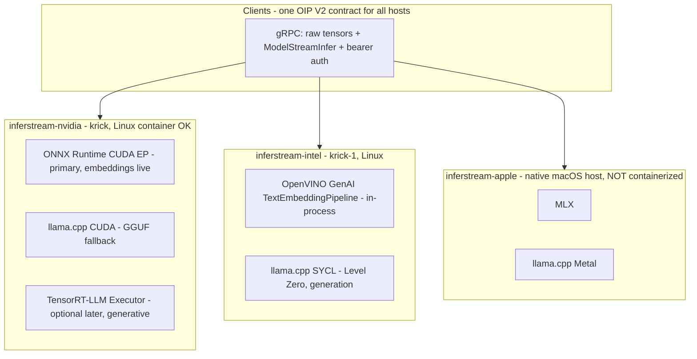

# inferstream

Lean, arch-specific **gRPC streaming inference / embedding servers** in Rust, sharing one wire contract: [KServe Open Inference Protocol (OIP) V2](https://github.com/kserve/open-inference-protocol) with raw byte tensors, bidirectional `ModelStreamInfer`, and bearer auth. Optimized for **raw latency and $/token** — a native, thread-safe alternative to DJL-style serving with no Java or Python hop between the socket and the engine.

One shared core (protocol, auth, routing), **three arch binaries**:

| binary | host class | engines | status |
|---|---|---|---|
| `inferstream-nvidia` | NVIDIA Linux (e.g. **krick**) | **ONNX Runtime CUDA EP** (primary — encoder embeddings) + **llama.cpp-CUDA** (GGUF generative token streaming, in-process), TensorRT-LLM Executor (optional later feature) | **ORT engine real** (`ort-runtime` / `ort-cuda`), validated on krick against TEI; **llama.cpp engine real in-process** (`llamacpp-runtime` / `llamacpp-cuda`, or `full-cuda` for both), streaming Qwen2.5-0.5B GGUF on krick; TRT-LLM link stubbed |
| `inferstream-intel` | Intel Linux (e.g. **krick-1**, Arc/Battlemage) | **OpenVINO GenAI** in-process `TextEmbeddingPipeline` (only Intel embed engine; cxx; GPU when available); **llama.cpp-SYCL in-process** (`llamacpp-sycl`, Level Zero / Battlemage) for GGUF generation | GenAI embed path landed (code + fetch); GPU live smoke is a krick-1 follow-up (`docs/intel-genai-embed.md`); llama.cpp SYCL in-process live (`default-llm` / `qwen-0.5b` / `qwen-7b`) |
| `inferstream-apple` | **native macOS host** (Mac worker) | **all-Swift gRPC server** (grpc-swift + in-process mlx-swift / mlx-swift-lm — no Rust façade, no FFI, no Python) | **MLX engine real** — Embed / Tokenize / Detokenize / `ModelStreamInfer` on Metal; see `docs/swift-apple.md` |
| `inferstream` | anywhere | mock only | fully working — dev/client-validation binary |

## Per-arch gap status (honest)

Every arch binary serves **both** gRPC services on one port behind one bearer interceptor: the vendored OIP V2 `inference.GRPCInferenceService` and the `inferstream.v1.InferstreamService` extension (Tokenize / Detokenize / Embed / ListModels / Rerank). Registration lives in the shared `serve()` in `crates/server/src/lib.rs`, and all three binaries reach it through the same `run_cli` path — audited: none of them can start without exposing the extension service.

| capability | `inferstream-nvidia` | `inferstream-intel` | `inferstream-apple` |
|---|---|---|---|
| Embed (real accelerator) | **LIVE** — ORT CUDA EP (CPU EP anywhere), TEI-parity validated on krick | **CODE LIVE** — in-process OpenVINO GenAI `TextEmbeddingPipeline` (cxx; GPU default). OVMS gRPC is out of scope. **GPU smoke not run on the cloud VM** — follow-up on krick-1 (`docs/intel-genai-embed.md`) | **LIVE** — native MLX (`MLXEmbedders`) on Metal, in-process Swift server |
| Tokenize / Detokenize | **LIVE** — ORT engine's own HF tokenizer or `tokenizer_dir` server-side; GGUF models answer from the llama.cpp vocab (in-process) | **LIVE** — `tokenizer.json` next to the GenAI OV dir; GGUF models answer from the in-process llama.cpp vocab (no remote `/tokenize`) | **LIVE** — swift-transformers from `tokenizer_dir` / `tokenizer.json` (in-process, no Rust) |
| Generative infer / stream | **LIVE** — llama.cpp-CUDA in-process (`llamacpp-cuda` / `full-cuda`) streams GGUF tokens over `ModelStreamInfer` (Qwen2.5-0.5B validated on krick); server-client mode (`endpoint`) also available; TRT-LLM (`trtllm-sys`) still a stub | **LIVE** — llama.cpp-SYCL **in-process** (`llamacpp-sycl`, GGML_SYCL=ON): unary `ModelInfer` + per-token `ModelStreamInfer` for `default-llm` / `qwen-0.5b` (Qwen2.5-0.5B Q8_0) and `qwen-7b` (Qwen2.5-7B-Instruct Q5_K_M, text — not VL). GPU-proven on krick-1 (`docs/intel-sycl-inprocess-krick-1.md`). Default aliases do **not** HTTP to `:8085`. In-process OpenVINO GenAI covers **embeddings** (not generation) | **LIVE** — native MLX generation (`mlx-swift-lm`) streams real per-token `ModelStreamInfer` chunks on Metal in the Swift server |
| `InferstreamService` registered in `serve()` | yes (shared) | yes (shared) | yes (shared) — binary compiles on Linux for CI, functions only on macOS |
| Rerank | mock scorer only | mock scorer only | mock scorer only |

### Apple MLX: all-Swift gRPC server

The supported Mac server is the Swift package in `swift/` — grpc-swift implements both `inference.GRPCInferenceService` and `inferstream.v1.InferstreamService` from the shared `proto/` files, and mlx-swift runs **in-process** (no Rust façade, no `libMlxEngine.dylib` FFI, no Python). Setup is `scripts/setup-mlx.sh` (`cargo xtask fetch --mlx`). Build/run: `make apple`. Smoke: `scripts/smoke-apple.sh` (starts the Swift server, then `inferstream-e2e --target apple`). Walkthrough: [`docs/swift-apple.md`](docs/swift-apple.md). The Rust `inferstream-apple` crate remains as a Linux-CI stub only.

**Current honest status:** the façade is real — gRPC service, streaming, auth, routing, raw-tensor wire helpers, mock backend, and all three arch binaries build and run today (`cargo test --workspace` passes with zero GPU libraries). **Six real engine paths are live.** NVIDIA embeddings: `backend-ort` loads ONNX embedding models (BGE/MiniLM class) through the `ort` crate with server-side tokenization, mean/CLS pooling, and L2 normalization — CPU EP anywhere, CUDA EP on the GPU host — and its output matches TEI on the same model to fp32 tolerance. NVIDIA generation: `backend-llamacpp` in-process (features `llamacpp-runtime` / `llamacpp-cuda`) loads GGUF models through `llama-cpp-2`, streaming one `token` BYTES chunk per decoded piece over `ModelStreamInfer` with a `final` flag on the last chunk; unary `ModelInfer` returns the whole completion, and Tokenize/Detokenize answer from the GGUF vocabulary. Intel embeddings: `inferstream-intel` with `backend = "openvino"` loads an in-process OpenVINO GenAI `TextEmbeddingPipeline` (cxx; plain strings; openvino-tokenizers; CLS/MEAN/LAST + L2; CPU/GPU/NPU). Default catalog device is GPU. **Code is landed; GPU live smoke is a krick-1 follow-up** (`docs/intel-genai-embed.md`). OVMS gRPC is out of scope. Intel generation: `backend-llamacpp` in-process SYCL (`llamacpp-sycl`) streams GGUF on Battlemage (`docs/intel-sycl-inprocess-krick-1.md`). Apple embeddings and generation: `backend-apple`'s `MlxBackend` runs **native MLX in-process** (Swift mlx-swift-lm on Metal; see `docs/native-mlx.md`) — validated with `scripts/smoke-apple.sh`. TRT-LLM remains a stub with full config surface; routing to it still fails at startup with the exact feature named. Beyond OIP, every binary now also serves the **`inferstream.v1` extension service** — Tokenize/Detokenize (server-side HF tokenizer), a typed `Embed` wrapper, `ListModels`, and a `Rerank` stub — documented below.

## Architecture



Shared plumbing lives in `crates/server` (service, auth interceptor, config, registry) behind a `BackendFactory` seam; each arch binary is a ~100-line factory that wires only its own engines. Nothing engine-specific leaks into the shared layer.

| Crate | Purpose |
|---|---|
| `crates/protocol` | Vendored OIP V2 proto + generated tonic types + raw tensor wire helpers |
| `crates/backend` | `Backend` trait, error types, model → backend `Registry` |
| `crates/backend-mock` | Deterministic mock (embeddings + chunked token streaming) — in every binary |
| `crates/backend-trtllm` | TensorRT-LLM **Executor** skeleton: config + OIP mapping (runtime link behind `trtllm-sys`) |
| `crates/backend-llamacpp` | llama.cpp for all flavors — device = `cuda` / `sycl` / `metal` / `vulkan` / `cpu` |
| `crates/backend-ort` | **ONNX Runtime embedding engine** (feature `runtime`; EPs: CPU / `cuda` / `tensorrt`) — tokenizes server-side, mean/CLS pooling + L2 norm; stub without the feature |
| `crates/backend-openvino` | **OpenVINO GenAI TextEmbeddingPipeline** (cxx; feature `genai`) — Intel CPU/GPU/NPU, stub without the feature. The only Intel embed engine. |
| `crates/backend-apple` | **Working** native MLX backend (`MlxBackend`) — in-process Swift FFI to mlx-swift / mlx-swift-lm on Metal; stub on Linux |
| `crates/server` | Shared: tonic service, auth, config, registry, CLI runner + mock-only `inferstream` bin |
| `crates/arch-nvidia` | `inferstream-nvidia` binary |
| `crates/arch-intel` | `inferstream-intel` binary |
| `crates/arch-apple` | `inferstream-apple` binary |
| `crates/turboembed` | Safe wrapper over the TurboEmbed C ABI (`include/turboembed.h`). NVIDIA: `--features ort-cuda` (ORT CUDA IoBinding). Intel: `--features genai`. Catalog aliases error without the real feature. |

## TurboEmbed

Universal **in-process embedding ABI** beside (not instead of) the arch
gRPC servers. One C header, C++ on nvidia/intel, Swift `@_cdecl` on
Apple, Rust crate on top. gRPC `Embed` / `EmbedStream` is a thin bonus
on the existing `inferstream.v1.InferstreamService`.

| piece | path |
|---|---|
| Architecture | [`docs/turboembed-architecture.md`](docs/turboembed-architecture.md) |
| Frozen C ABI | [`include/turboembed.h`](include/turboembed.h) (Apple copy: `swift/Sources/TurboEmbedC/include/turboembed.h`) |
| C++ stub | [`native/turboembed`](native/turboembed) |
| Rust crate | `crates/turboembed` |
| Swift shim | `swift/Sources/TurboEmbed` — [`docs/turboembed-swift.md`](docs/turboembed-swift.md) |
| Drift matrix | [`docs/turboembed-drift.md`](docs/turboembed-drift.md) · `make e2e-drift` |
| NVIDIA ORT CUDA | [`docs/turboembed.md`](docs/turboembed.md) · `make test-turboembed-nvidia` |

```bash
make turboembed-stub          # native/turboembed/build/libturboembed.a
cargo test -p turboembed      # links the stub; ABI smoke (no GPU)
make test-turboembed-nvidia   # --features ort-cuda; ORT CUDA IoBinding MiniLM
make test-turboembed-intel    # --features genai; TextEmbeddingPipeline on GPU
make e2e-drift                # skip unless *_ADDR / DUMP_* set
```

Without a real provider feature the stub answers `mock-embed` and returns
`NOT_IMPLEMENTED` for catalog aliases (`minilm`, …). `--features ort-cuda`
loads MiniLM through ORT CUDA + IoBinding device buffers (no CPU fallback).
`--features genai` loads `ov::genai::TextEmbeddingPipeline` on **GPU**.
Receipts: `testdata/receipts/turboembed/nvidia-minilm.json`,
`intel-minilm.json`. Inferstream servers are unchanged.

## Building each arch binary

Everything below builds on a plain Linux box today (engines are stubs); the extra host requirements kick in when the real engine links land.

```bash
# Dev / client validation (mock only) — anywhere
cargo run -p inferstream-server -- --config config/example.toml

# NVIDIA (krick): stub surface builds anywhere. The real embedding engine is
# ONNX Runtime — `ort`'s download-binaries fetches a matching libonnxruntime
# at build time, so no system ORT install is needed:
cargo build -p inferstream-arch-nvidia --release --features ort-runtime  # CPU EP, anywhere
cargo build -p inferstream-arch-nvidia --release --features ort-cuda     # CUDA EP, GPU host
# Full krick surface: ORT-CUDA embeddings + llama.cpp-CUDA GGUF generation.
# llama.cpp compiles from source with nvcc; when the host's default gcc is
# newer than nvcc supports, name a compatible host compiler:
CUDAHOSTCXX=/usr/bin/g++-13 CUDAARCHS=89 \
    cargo build -p inferstream-arch-nvidia --release --features full-cuda
cargo build -p inferstream-arch-nvidia --release --features trtllm-sys   # optional later: TRT-LLM
./target/release/inferstream-nvidia --config config/nvidia.toml
# See "NVIDIA GPU host requirements" below for the CUDA 13 runtime libs the
# ort-cuda build loads at startup.

# Intel (krick-1): stub surface builds anywhere. Real SYCL + GenAI:
scripts/build-intel.sh                  # ggml-sycl + icpx rustc link; no python3
make fetch-llms                         # SHA-256-pinned GGUF; no python3
scripts/run-intel.sh --config config/intel.toml

# Apple: build and run ON THE MAC, never in a container.
# Supported path is the Swift server (no Rust process):
make apple
./swift/.build/release/inferstream-apple --config config/apple.toml
```

Routing a model to an engine a binary doesn't ship fails **at startup** with the exact feature flag or the right binary named — never at request time.

### NVIDIA GPU host requirements (ort-cuda)

The `ort` crate's prebuilt CUDA bundle (ONNX Runtime 1.28) is built against **CUDA 13**, so the CUDA EP needs at runtime:

- NVIDIA driver new enough for CUDA 13 (krick's 595.84 → CUDA 13.2: OK).
- CUDA 13 user-space runtime libs: `libcublasLt.so.13`, `libcublas.so.13`, `libcudart.so.13`, `libnvrtc.so.13`, and a cuDNN 9 built for CUDA 13. A CUDA **12** toolkit (krick's 12.4) does **not** satisfy this.

**Bundled route (recommended, no sudo)** — the repo script curls pinned
NVIDIA wheels (~1.6 GB), verifies SHA-256, unzips the `.so` files into
`.libs/nvidia/lib`, and the run wrapper sets the loader path:

```bash
scripts/fetch-runtime-libs.sh nvidia          # once per host; pinned wheel hashes
cargo build -p inferstream-arch-nvidia --release --features ort-cuda
scripts/run-nvidia.sh --config config/nvidia.toml   # sets LD_LIBRARY_PATH, execs the binary
```

With sudo, a system install from the NVIDIA apt repo is also fine:

```bash
sudo apt install cuda-runtime-13-2 libcudnn9-cuda-13
```

libonnxruntime itself is fetched at **build time** by `ort`'s
`download-binaries` feature, so no system ORT install is ever needed.

**Intel bundling:** in-process GenAI links the host OpenVINO + OpenVINO
GenAI + openvino-tokenizers install (oneAPI / standalone toolkit) — those
GPU plugins are not fetched by `scripts/fetch-runtime-libs.sh intel`.
Model IR dirs are `make fetch-ov-genai`. OVMS gRPC is out of scope.
See `docs/intel-genai-embed.md`.

EP registration uses `error_on_failure`: if these libs are missing the binary **fails at startup** with the loader's actual error instead of silently serving on CPU. `device = "tensorrt"` (build feature `ort-tensorrt`) additionally requires TensorRT 10 (`sudo apt install tensorrt-libs` from the NVIDIA repo) — not installed on krick today, so stay on `device = "cuda"`.

## Logical model names (alias catalog)

Clients address models by **logical name** — `model_name: "minilm"` works against all three arch binaries, and each host loads its own optimized artifact. Clients never learn whether that's an ORT CUDA session, an in-process OpenVINO GenAI pipeline, or an MLX model.

The catalog covers the popular embedding families and a small set of generative LLM aliases. An alias resolves only on arches with a **real** backend path (no fakes); `—` means unsupported there today, with the add-recipe documented in `config/catalog.toml`:

| alias | dims | `inferstream-nvidia` (ORT CUDA) | `inferstream-intel` (GenAI) | `inferstream-apple` (MLX) |
|---|---|---|---|---|
| `minilm` | 384 | TEI HF ONNX snapshot (on krick today) | `models/ov/minilm` (GenAI) | `sentence-transformers/all-MiniLM-L6-v2` FP MLX (live) |
| `minilm-l12` | 384 | fetch† | `models/ov/minilm-l12` | `sentence-transformers/all-MiniLM-L12-v2` |
| `mpnet` | 768 | fetch† | `models/ov/mpnet` | — (no MPNet in mlx-embeddings) |
| `bge-small` | 384 | fetch† | `models/ov/bge-small` | `BAAI/bge-small-en-v1.5` FP MLX (live) |
| `bge-base` | 768 | fetch† | `models/ov/bge-base` (full GenAI IR) | `BAAI/bge-base-en-v1.5` |
| `bge-large` | 1024 | fetch† | `models/ov/bge-large` | `BAAI/bge-large-en-v1.5` |
| `bge-m3` | 1024 | fetch† | `models/ov/bge-m3` | `BAAI/bge-m3` |
| `e5-small` | 384 | fetch† | `models/ov/e5-small` | `intfloat/multilingual-e5-small` |
| `e5-base` | 768 | fetch† | `models/ov/e5-base` | `intfloat/multilingual-e5-base` |
| `e5-large` | 1024 | fetch† | `models/ov/e5-large` | `intfloat/multilingual-e5-large` |
| `gte-small` | 384 | fetch† | `models/ov/gte-small` | `thenlper/gte-small` |
| `gte-base` | 768 | fetch† | `models/ov/gte-base` | `thenlper/gte-base` |
| `nomic-embed-text` | 768 | fetch† (untested) | `models/ov/nomic-embed-text` | — (no NomicBERT in mlx-embeddings) |

| alias | class | `inferstream-nvidia` (llama.cpp CUDA GGUF) | `inferstream-intel` (llama.cpp SYCL server-client) | `inferstream-apple` (native MLX) |
|---|---|---|---|---|
| `default-llm` | Qwen2.5-0.5B-Instruct | krick GGUF `/work/models/gguf/qwen2.5-0.5b-instruct-q8_0.gguf` (served) | fetch‡ `models/gguf/qwen-0.5b/` Q8_0 in-process SYCL (served) | `mlx-community/Qwen2.5-0.5B-Instruct-4bit` (served) |
| `qwen-0.5b` | Qwen2.5-0.5B-Instruct smoke | fetch‡ `models/gguf/qwen-0.5b/` Q8_0 | same fetched GGUF, in-process SYCL (served) | same MLX 4-bit as `default-llm` |
| `qwen-7b` | Qwen2.5-7B-Instruct (text) | fetch‡ official Q5_K_M shards (~5.1 GiB) | same fetched GGUF, in-process SYCL (served) | `mlx-community/Qwen2.5-7B-Instruct-4bit` |

† `make fetch-embeddings [ALIASES=alias1,alias2]` (or `cargo run -p inferstream-fetch -- <alias> …`) downloads a prebuilt ONNX export + tokenizer into `models/onnx/<alias>/`; then add the alias to `serve`. Every download is pinned to an exact HF revision and **SHA-256-verified** against `models/manifests/embeddings.json`.

‡ `make fetch-llms [ALIASES=qwen-0.5b,qwen-7b]` (or `cargo run -p inferstream-fetch -- --llms …`) downloads the official Qwen GGUF + `tokenizer.json` into `models/gguf/<alias>/`, SHA-256-verified against `models/manifests/llms.json`. **No python3.** Apple native MLX weights: `make fetch-mlx` (`cargo xtask fetch --mlx`). Weights are **never** committed. See [`docs/fetching-models.md`](docs/fetching-models.md).

Apple entries load local directories from `make fetch-mlx` (`models/mlx/<alias>/`). Tokenize for llama.cpp answers from the GGUF vocab in-process; apple LLM aliases use the fetched `tokenizer_dir` via the Rust `tokenizers` crate. Pooling follows each embedding family's convention (BGE = CLS, everything else mean); E5 models expect `query:` / `passage:` text prefixes from the client. Intel LLM aliases load the **matching** official Qwen GGUF on SYCL (0.5B Q8_0 / 7B-Instruct Q5_K_M) — not the VL-7B llama-server on `:8085`.

The mapping lives in the **catalog** (`config/catalog.toml`, compiled into every binary): one table per alias, one sub-table per arch with the same fields as a `[[models]]` entry, minus `name`. Arch configs opt in with a top-level `serve` list:

```toml
# defaults shipped today:
serve = ["minilm", …, "default-llm"]                    # nvidia (0.5B GGUF on krick)
serve = ["minilm", "mpnet", …, "default-llm", "qwen-0.5b", "qwen-7b"] # intel (GenAI embed + in-process SYCL)
serve = ["minilm", "minilm-l12", "bge-small", "default-llm", "qwen-0.5b"] # apple (0.5B MLX)
```

At startup each alias expands into a regular registry entry **named by the alias**, so `ListModels` and `ModelMetadata` report `minilm` (with the resolved backend and artifact in `backend` / `platform` / properties like `model_path`), and every RPC — `ModelInfer`, `ModelStreamInfer`, `Tokenize`, `Embed` — routes by it:

```bash
grpcurl -plaintext -proto proto/inferstream_extension.proto \
  -H 'authorization: Bearer <key>' \
  -d '{"model_name":"minilm","texts":["hello world"]}' \
  <any-arch-host>:8461 inferstream.v1.InferstreamService/Embed
```

**Adding an alias:** add a `[models.<alias>]` table to `config/catalog.toml` with a `[models.<alias>.<arch>]` sub-table per arch that can serve it (arches: `nvidia`, `intel`, `apple`), rebuild, and list the alias in `serve`. To change resolutions per host **without rebuilding**, point the config at a catalog copy: `catalog = "/etc/inferstream/catalog.toml"`. The built-in matrix is enforced by a unit test (`BUILTIN_MATRIX` in `crates/server/src/catalog.rs`) — extend it when the catalog changes.

**Parity gate (canonical):** `inferstream-e2e` (`crates/e2e`) is the unified client-side suite — same cases against nvidia / intel / apple. It talks gRPC to an already-running server and never starts remote GPUs. See [`docs/e2e.md`](docs/e2e.md).

```bash
make e2e-nvidia          # default krick:8461; FETCH=1 pulls missing ONNX/GGUF
make e2e-intel           # default krick-1:8461; FETCH=1 pulls ov-genai + GGUF
make e2e-apple           # default krickert-mac:8461; FETCH=1 → xtask --mlx
make e2e-nvidia FETCH=0  # skip download
make e2e-all             # only arches whose INFERSTREAM_E2E_<ARCH>_ADDR is set
cargo run -p inferstream-e2e -- --target nvidia --addr krick:8461 --token "$KEY" --fetch
```

`scripts/smoke-embeddings.sh` / `scripts/smoke-llms.sh` / the RPC half of `scripts/smoke-apple.sh` are thin wrappers around this harness. Bring-up: `make e2e-<arch>` (`FETCH=1` default) or `make fetch-e2e-<arch>` / `scripts/ensure-models.sh <arch>` downloads only missing or hash-mismatched files via `inferstream-fetch` (SHA-256 manifests; no python3), then the suite. `make e2e-mock` does not fetch. Optional soak/STS corpus: `make fetch-corpus` / `FETCH_CORPUS=1` (off in CI). Cross-arch embedding parity: `make e2e-parity` / `make e2e-parity-goldens` — cosine **0.99** nvidia↔intel MiniLM FP, **0.97** when apple is in the pair (English MiniLM is ~1.000; min 0.9795 is CJK UNK drift); see [`docs/e2e-parity.md`](docs/e2e-parity.md). See [`docs/e2e.md`](docs/e2e.md).

Failures are startup-time and actionable: an unknown alias lists what the catalog defines; an alias with no resolution for this arch names the arches that have one. Explicit `[[models]]` entries keep working alongside `serve` (collisions are rejected), and the arch-neutral dev `inferstream` binary rejects `serve` since it has no arch.

## Why per-arch binaries (and why a façade at all)

- **Latency and $/token, not portability theater.** Each accelerator's peak path is a different runtime (TRT-LLM Executor vs Level Zero vs Metal/MLX). One fat binary linking all of them means compromise flags, giant images, and driver conflicts. Three lean binaries mean each host runs exactly its optimum and nothing else.
- **No Java/Python hop.** Unlike DJL (JVM) or Python servers, the socket-to-engine path is a single Rust process; streaming tokens don't cross an interpreter.
- **Not NIM.** NVIDIA NIM wraps engines in an OpenAI-style HTTP service. inferstream keeps engines in-process under its own gRPC (ORT EPs now; TRT-LLM Executor when generative LLMs are mandated). **NIM is used as a benchmark oracle only**: we run NIM beside `inferstream-nvidia` on the same GPU and model to sanity-check our tokens/sec and TTFT — if we're slower than the HTTP wrapper, that's a bug to fix, not a product to adopt.
- **Not OVMS/Triton/TEI.** Those own the process and the protocol; adding an engine or changing streaming/auth policy means forking C++ serving infrastructure. Here the protocol layer is ours, engines are leaf dependencies behind one trait — and clients speak the same OIP V2 they'd speak to Triton anyway. Intel embeddings run **in-process** OpenVINO GenAI (`TextEmbeddingPipeline`); inferstream does not depend on a host OVMS container.

## Bake-off methodology (upcoming, per arch)

Metrics collected per engine/model/host, same client, same prompts:

| metric | definition |
|---|---|
| TTFT | request sent → first `ModelStreamInfer` chunk (p50/p95/p99) |
| ITL | inter-token latency between stream chunks (p50/p95) |
| tokens/sec | steady-state decode throughput, per stream and aggregate |
| embed p95 | unary `ModelInfer` latency for the embedding model |
| max concurrent streams | before p95 TTFT doubles |
| watts + $/1M tokens | wall power (or cloud $/hr) ÷ aggregate throughput |

Planned matchups:

- **krick (NVIDIA):** embeddings first — ORT CUDA EP vs ORT TensorRT EP vs llama.cpp-CUDA, with **NIM as oracle** where a comparable NIM exists. TRT-LLM Executor enters the generation matchup only once generative LLMs are mandated.
- **krick-1 (Intel Battlemage):** in-process OpenVINO GenAI embeddings (GPU) vs llama.cpp-SYCL generation, both via `inferstream-intel`.
- **Mac:** MLX vs llama.cpp-Metal on the same GGUF/MLX model pair (needs the Mac "My Machines" worker for real builds).

Results land in `docs/bakeoff/` as they happen; no numbers are published until they come from these builds on this contract (no vendor-quoted numbers).

## Protocol notes

The proto source of truth is `proto/open_inference_grpc.proto`, vendored from [kserve/open-inference-protocol](https://github.com/kserve/open-inference-protocol), pinned at commit `d49cc23f89d709d87b210ef9449e273ae243984e`. Rust (`crates/protocol`) and the Swift Apple server both compile these files — see [`proto/README.md`](proto/README.md).

Upstream OIP defines only unary `ModelInfer`. inferstream adds a clearly marked extension:

- `rpc ModelStreamInfer(stream ModelInferRequest) returns (stream ModelStreamInferResponse)` — the de-facto streaming shape established by NVIDIA Triton's `grpc_service.proto`, so existing streaming clients interoperate.
- Multiple requests can be multiplexed on one stream; every response chunk **echoes the request `id`** for correlation, and a backend may emit many chunks per request (one per generated token). Per-request failures are reported in `error_message` without tearing down the stream.
- `ServerMetadata.extensions` advertises `model_stream_infer` and `inferstream.v1`.

## INFERSTREAM EXTENSION: `inferstream.v1.InferstreamService`

A second, clearly separated gRPC service (`proto/inferstream_extension.proto`) runs on the same endpoint with the same bearer auth. The vendored OIP service is untouched — clients that only speak OIP lose nothing (every `Embed` is expressible as `ModelInfer` with a BYTES `text` tensor plus the `pooling` / `normalize` / `truncate` InferParameters).

| RPC | what it does |
|---|---|
| `Tokenize` | batch tokenization with the model's server-side tokenizer: `input_ids`, `attention_mask`, token strings, byte offsets on request, optional truncation and pad-to-longest |
| `Detokenize` | inverse of Tokenize; `skip_special_tokens` drops CLS/SEP/PAD frames |
| `Embed` | typed convenience wrapper over ModelInfer — send strings, get `float` vectors back; pooling/normalize/truncate forwarded as InferParameters |
| `ListModels` | one call for the whole repository: name, backend id, readiness, platform, embedding dim, tokenizer availability |
| `Rerank` | query/document relevance scores, sorted, with `top_n`; engines without a reranker answer `UNAVAILABLE` (the mock implements a deterministic scorer so the wire path tests everywhere) |

Tokenizer resolution: when a model's config sets `tokenizer_dir` (a `tokenizer.json` file or a directory containing one), the server loads a local HuggingFace fast tokenizer at startup and answers Tokenize/Detokenize itself. Without a configured tokenizer the request is delegated to the backend (the ORT engine reuses its own HF tokenizer; the mock ships a lossless byte-level tokenizer; everything else reports `UNAVAILABLE` with the config fix named).

grpcurl examples (mock server from `config/example.toml`):

```bash
PROTO="-proto proto/inferstream_extension.proto"

# Repository listing: names, backends, readiness, dims
grpcurl -plaintext $PROTO 127.0.0.1:8461 inferstream.v1.InferstreamService/ListModels

# Batch tokenize with offsets and padding
grpcurl -plaintext $PROTO \
  -d '{"model_name":"mock-embed","texts":["hello world","hi"],"with_offsets":true,"pad_to_longest":true}' \
  127.0.0.1:8461 inferstream.v1.InferstreamService/Tokenize

# Detokenize (skip special tokens)
grpcurl -plaintext $PROTO \
  -d '{"model_name":"mock-embed","sequences":[{"ids":[1,107,108,2]}],"skip_special_tokens":true}' \
  127.0.0.1:8461 inferstream.v1.InferstreamService/Detokenize

# Embed without touching raw tensors
grpcurl -plaintext $PROTO \
  -d '{"model_name":"mock-embed","texts":["hello world"],"pooling":"mean","normalize":true}' \
  127.0.0.1:8461 inferstream.v1.InferstreamService/Embed

# Rerank with top_n
grpcurl -plaintext $PROTO \
  -d '{"model_name":"mock-embed","query":"rust inference","documents":["cooking pasta","rust inference server"],"top_n":1}' \
  127.0.0.1:8461 inferstream.v1.InferstreamService/Rerank
```

With bearer auth enabled add `-H 'authorization: Bearer <key>'` — the extension service sits behind the same interceptor.

Raw tensor rules (helpers in `inferstream_protocol::tensor`):

- Fixed-size dtypes (`FP32`, `INT64`, …) are flat, row-major, **little-endian** byte blobs in `raw_input_contents` / `raw_output_contents`; blob length must equal `element_count(shape) * element_size`.
- `BYTES` elements are length-prefixed with a little-endian `u32`.
- `FP16` / `BF16` exist only in raw form — one more reason raw is the primary path.

Generation contract (all engines, identical to what the mock emits today): input `text` (BYTES) or `input_ids` (INT32); each stream chunk carries `token` (BYTES) and sets the bool parameter `final` on the terminal chunk. Embeddings: unary, output `embedding` FP32 `[d]`. Clients don't change between the mock and a GPU engine.

## Testing & reference embeddings (goldens)

```bash
cargo test --workspace          # 90+ tests, passes with zero GPU libraries
                                # (includes inferstream-e2e against the mock)
make e2e-nvidia                 # live suite; FETCH=1 pulls missing weights first
make fetch-corpus               # optional Tiny Shakespeare + STS (off in CI)
make e2e-parity                 # cross-arch cosine when *_ADDR / DUMP_* set
make e2e-drift                  # popular models × arches; same floors (docs/turboembed-drift.md)
```

Fixed prompts (short / medium / empty / unicode / long-truncation) live as JSON goldens in `testdata/reference_embeddings/`. The deterministic-mock goldens run on every `cargo test` (cosine ≥ 0.999 plus exact-value and L2 checks, both directly and end-to-end through the `Embed` RPC); regenerate them with `cargo run -p inferstream-server --example gen_reference_embeddings`. GPU goldens for the real engines are `#[ignore]`d and feature-gated (`cargo test -p inferstream-backend-ort --features cuda -- --ignored gpu_golden` on krick) — see [`testdata/reference_embeddings/README.md`](testdata/reference_embeddings/README.md) for the schema and the krick/krick-1 regeneration walkthrough.

## Trying it now

```bash
cargo test --workspace          # passes with no GPU libs
cargo run -p inferstream-server -- --config config/example.toml
# in another shell — unary embed + two multiplexed bidi streams:
cargo run -p inferstream-server --example client -- http://127.0.0.1:8461
```

grpcurl works against any binary with the vendored proto:

```bash
grpcurl -plaintext -proto proto/open_inference_grpc.proto \
  127.0.0.1:8461 inference.GRPCInferenceService/ServerLive

# Unary infer: "hi" as a length-prefixed BYTES tensor (base64 of 02 00 00 00 68 69)
grpcurl -plaintext -proto proto/open_inference_grpc.proto \
  -d '{"model_name":"mock-embed","id":"r1","inputs":[{"name":"text","datatype":"BYTES","shape":[1]}],"raw_input_contents":["AgAAAGhp"]}' \
  127.0.0.1:8461 inference.GRPCInferenceService/ModelInfer
```

## Auth

Static **bearer tokens (API keys)** enforced by a tonic interceptor on every RPC, on every binary:

```toml
[auth]
mode = "bearer"
bearer_tokens = ["change-me"]     # and/or the env var below
```

```bash
INFERSTREAM_API_KEYS="key-a,key-b" ./target/release/inferstream-nvidia --config config/nvidia.toml
```

Clients send gRPC metadata `authorization: Bearer <key>` (`grpcurl -H 'authorization: Bearer key-a' …`). Comparison is constant-time per candidate. Bearer keys need an encrypted transport: TLS/mTLS is the next auth step — tonic's `ServerTlsConfig` (with `client_ca_root` for mTLS) slots into `serve()` in `crates/server/src/lib.rs` without touching the service layer. Until then terminate TLS in front or stay on trusted networks. No quotas by design.

## Deployment: Apple hosts vs Linux containers

NVIDIA CUDA passes into Linux containers via the NVIDIA container toolkit. **Apple GPU (Metal) and the Neural Engine do not** — there is no macOS container GPU passthrough, and Linux containers on a Mac run inside a VM without Metal. Therefore:

- `inferstream-nvidia` and `inferstream-intel` deploy as Linux containers (or bare processes) on their GPU hosts.
- `inferstream-apple` deploys **natively on the Mac** (launchd service or plain process). It compiles on Linux as a stub so CI type-checks the wiring, but it only functions on macOS.

Same client, same contract, heterogeneous fleet: krick (NVIDIA) + krick-1 (Intel) + Mac workers behind one OIP endpoint shape.

## Roadmap

1. ~~ONNX Runtime session wiring (`backend-ort`)~~ — **done**: CPU + CUDA EPs, embeddings live on krick; TensorRT EP wired but blocked on host TensorRT libs.
2. ~~**OVMS client backend**~~ — **removed**: inferstream no longer fronts OpenVINO Model Server. Intel embeds are GenAI only (`docs/adding-ovms-embedding-pipelines.md`).
3. ~~**OpenVINO GenAI runtime link** (`backend-openvino`, feature `genai`)~~ — **code done**: in-process `TextEmbeddingPipeline` is the only Intel embed path. GPU live smoke is a krick-1 follow-up (`docs/intel-genai-embed.md`).
4. ~~**llama.cpp FFI** (`backend-llamacpp`)~~ — **done for CPU/CUDA** via `llama-cpp-2` (features `runtime` / `cuda`, `metal` wired but unbuilt): GGUF token streaming live on krick (Qwen2.5-0.5B Q8_0, full GPU offload). SYCL and Vulkan flavors still pending.
5. ~~**MLX** (`backend-apple`)~~ — **done**, then rebuilt as an **all-Swift gRPC server** (`swift/`, `make apple`): Embed, Tokenize/Detokenize, and streamed generation live on Apple silicon with no Rust serve process (`scripts/smoke-apple.sh`).
6. **TRT-LLM Executor FFI** (`backend-trtllm`, feature `trtllm-sys`) — optional later feature for generative models; cxx/bindgen layer over `tensorrt_llm::executor`.
7. **TLS / mTLS** in `serve()`; per-key model ACLs after.
8. Optional adapters: TEI-compatible proto (lowest priority), shared-memory tensor hints, richer stream metadata.
9. ORT session pooling (today one session per model behind a mutex; ONNX Runtime's intra-op threads still parallelize each request).

Out of scope: dual independent pub/sub subscribe streams ("Surface 1") — request-scoped bidi only. No NIM HTTP wrapping, ever.

## License

[Apache-2.0](LICENSE). Contributions welcome — see [CONTRIBUTING.md](CONTRIBUTING.md).
