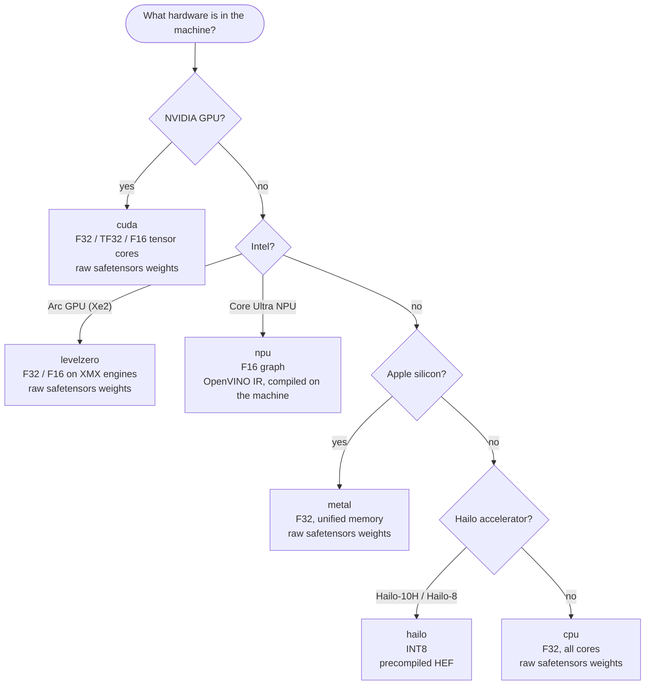
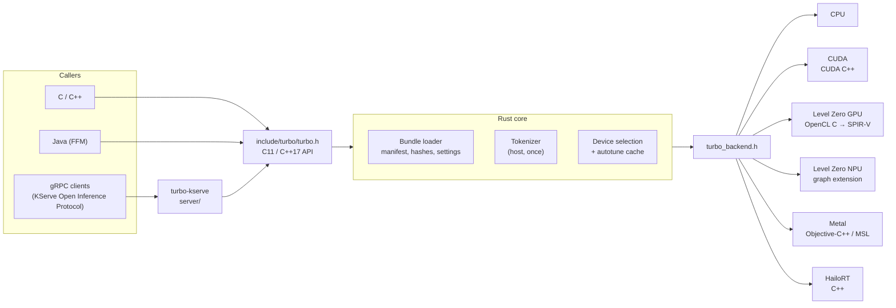
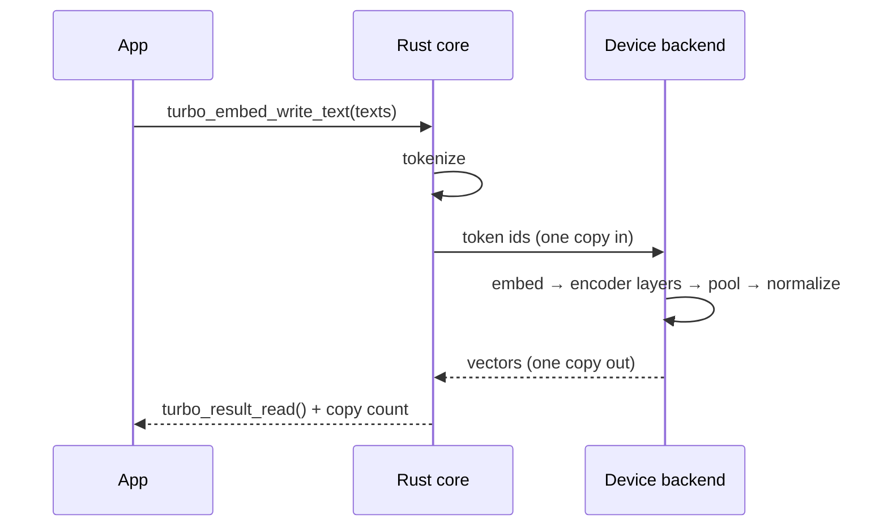

# TurboEmbed

TurboEmbed is a native library for running text embedding models fast on
the hardware you already have. It exposes a small C API, and behind that
API each backend is written directly against the vendor's own low-level
interface: CUDA on NVIDIA, Level Zero on Intel GPUs and NPUs, Metal on
Apple silicon, HailoRT on Hailo accelerators, and an optimized CPU path
everywhere else.

Embedding is supported today: text in, vectors out. Reranking,
classification, token tagging and chunking will be added to the API as
they are built.

## Supported hardware

| Hardware | Backend | Cargo feature | Model format | Setup |
|---|---|---|---|---|
| Any CPU (Linux, macOS, Windows) | `cpu` | default | safetensors | [cpu.md](docs/setup/cpu.md) |
| NVIDIA GPU (RTX 4080, data-centre cards, Jetson Orin) | `cuda` | `cuda` | safetensors | [cuda.md](docs/setup/cuda.md) |
| Intel Arc GPU, Xe2 / Battlemage (Arc Pro B70) | `levelzero` | `levelzero` | safetensors | [intel-gpu.md](docs/setup/intel-gpu.md) |
| Intel Core Ultra NPU (AI Boost) | `npu` | `npu` | OpenVINO IR | [intel-npu.md](docs/setup/intel-npu.md) |
| Apple silicon Mac (M1 and later) | `metal` | `metal` | safetensors | [apple-metal.md](docs/setup/apple-metal.md) |
| Raspberry Pi 5 with Hailo-10H | `hailo` | `hailo` | HEF | [hailo-10h.md](docs/setup/hailo-10h.md) |
| Hailo-8 / Hailo-8L board | `hailo` | `hailo` | HEF | [hailo-8.md](docs/setup/hailo-8.md) |

Backends combine in one build (`--features cuda,levelzero`), and the
library lists every device it finds, accelerators first, then the CPU.

### Choosing a backend


```mermaid
flowchart TD
    start([What hardware is in the machine?])
    start --> nv{NVIDIA GPU?}
    nv -- yes --> cuda["cuda<br/>F32 / TF32 / F16 tensor cores<br/>raw safetensors weights"]
    nv -- no --> intel{Intel?}
    intel -- "Arc GPU (Xe2)" --> lz["levelzero<br/>F32 / F16 on XMX engines<br/>raw safetensors weights"]
    intel -- "Core Ultra NPU" --> npu["npu<br/>F16 graph<br/>OpenVINO IR, compiled on the machine"]
    intel -- no --> apple{Apple silicon?}
    apple -- yes --> metal["metal<br/>F32, unified memory<br/>raw safetensors weights"]
    apple -- no --> hailo{Hailo accelerator?}
    hailo -- "Hailo-10H / Hailo-8" --> hef["hailo<br/>INT8<br/>precompiled HEF"]
    hailo -- no --> cpu["cpu<br/>F32, all cores<br/>raw safetensors weights"]
```

GPU backends run the model from its raw weights with kernels of their
own. The NPU and Hailo backends run a graph compiled for the device, so
a bundle needs that compiled artifact to use them. If a device cannot
run a model, the call fails with the reason; the library never quietly
falls back to another device.

### Precision tiers

A session picks one of three tiers. What each resolves to depends on the
device:

| Backend | `MODEL` | `FASTEST` | `EXACT` |
|---|---|---|---|
| CPU | F32 | F32 | F32 |
| CUDA | F32 (TF32 opt-in) | F16 on tensor cores | F32 |
| Intel GPU | F32 | F16 on matrix engines | F32 |
| Intel NPU | F16 | F16 | not available |
| Apple Metal | F32 | F32 | F32 |
| Hailo | INT8 | INT8 | not available |

Every tier is held to an accuracy bound against the reference vectors
shipped with the model (cosine ≥ 0.9999 for F32, ≥ 0.999 for F16/BF16,
≥ 0.93 for INT8).

## How it works


```mermaid
flowchart LR
    subgraph clients[Callers]
        c["C / C++"]
        j["Java (FFM)"]
        g["gRPC clients<br/>(KServe Open Inference Protocol)"]
    end
    g --> srv["turbo-kserve<br/>server/"]
    c --> h
    j --> h
    srv --> h
    h["include/turbo/turbo.h<br/>C11 / C++17 API"] --> core
    subgraph core[Rust core]
        b["Bundle loader<br/>manifest, hashes, settings"]
        t["Tokenizer<br/>(host, once)"]
        s["Device selection<br/>+ autotune cache"]
    end
    core --> be["turbo_backend.h"]
    be --> cpu["CPU"]
    be --> cuda["CUDA<br/>CUDA C++"]
    be --> lz["Level Zero GPU<br/>OpenCL C → SPIR-V"]
    be --> npu["Level Zero NPU<br/>graph extension"]
    be --> metal["Metal<br/>Objective-C++ / MSL"]
    be --> hailo["HailoRT<br/>C++"]
```

- **One task per call.** "Embed these texts" is one call. The backend
  runs every stage on the device and keeps intermediate data there; only
  the final vectors come back. Each host-device copy is counted and
  returned with the result.
- **Models travel as bundles.** A bundle is a directory with a manifest,
  hashes, weights, the tokenizer and the model's settings (pooling,
  normalization, sequence length, prefixes, output dimension). The same
  bundle gives the same answer on every machine.
- **Tokenization happens once, on the host,** so token ids are identical
  regardless of backend.
- **Selection is part of the API.** Ask for a task and optional
  constraints; the library returns the bundles that can do it, the
  fastest device for it, and the benchmark record behind that choice.


```mermaid
sequenceDiagram
    participant App
    participant Core as Rust core
    participant Dev as Device backend
    App->>Core: turbo_embed_write_text(texts)
    Core->>Core: tokenize
    Core->>Dev: token ids (one copy in)
    Dev->>Dev: embed → encoder layers → pool → normalize
    Dev-->>Core: vectors (one copy out)
    Core-->>App: turbo_result_read() + copy count
```

## Speed over elegance

TurboEmbed deliberately trades elegance for speed. A portable graph
runtime would mean one code path for every device and far less code.
We chose the opposite:

- **A separate backend per vendor,** each in the vendor's own language
  and at the lowest layer it exposes. That means duplicated logic across
  CUDA, OpenCL C, Metal Shading Language and C++, and that is accepted.
- **Kernels tuned per architecture and per shape.** On NVIDIA, GEMM
  tiles, split strategies and attention kernels are chosen per GPU
  generation and input shape, and an autotuner caches what it measures.
- **No generic fallback.** A device either runs the model at full speed
  or refuses it with a reason. Nothing is silently substituted.
- **The vendor's fastest program is the baseline.** If a backend is
  slower than the best reference program on the same inputs (TensorRT,
  OpenVINO, Hugging Face TEI), that is treated as a bug.

Performance claims are backed by data, not prose. A capability is
reported as supported only when a record in `benchmarks/records/` backs
it: a measurement on a named class of device, at a named commit, against
the vendor's fastest program at a pinned version, with the command that
produced it. See [docs/benchmarks.md](docs/benchmarks.md).

## Quick start

```sh
# Build the library with the backend for your hardware
cargo build --release -p turbo --features cuda    # or levelzero, npu, metal, hailo; omit for CPU only

# Build and run the C example against the bundled test model
cc -std=c11 -I include docs/setup/embed.c -L target/release -lturbo \
    -Wl,-rpath,$PWD/target/release -o embed
./embed testdata/tiny-bert-bundle 0 model
```

Each setup page has a check script under `scripts/setup/` that reports
what is missing and, with `--install`, installs it. To run the gRPC
server instead, see [docs/grpc.md](docs/grpc.md).

To verify a machine produces correct vectors:

```sh
TURBO_TEST_BUNDLE=<bundle-dir> TURBO_TEST_DEVICE=<backend> TURBO_TEST_PRECISION=<tier> \
    cargo test --release -p turbo --features <feature> --test conformance -- --include-ignored
```

## Repository layout

| Path | Contents |
|---|---|
| `include/turbo/` | The public C API (`turbo.h`) and the backend interface |
| `core/` | Rust core and every backend (`cuda/`, `levelzero/`, `metal/`, `hailo/`, `src/`) |
| `bundle/` | `turbo-bundle`: build, verify and distill model bundles |
| `bench/` | `turbo-bench`: produce benchmark records |
| `server/` | `turbo-kserve`: gRPC server (Open Inference Protocol) |
| `demo/` | Browser page for trying the server |
| `benchmarks/records/` | Benchmark records that back capability claims |
| `docs/` | Design, backend and setup documentation |
| `scripts/setup/` | Per-machine check and install scripts |

## Project principles

- Nothing is called working until it has run on real hardware. Tests
  that cannot run on the current machine are skipped and say so.
- Model settings live in the bundle, not in code.
- No Python in the tree. Vendor Python tools run in pinned containers,
  driven from Rust.
- The C header is designed by hand; changes to it are design decisions,
  and nothing is added that a built feature does not need.

## Documentation

| Topic | Page |
|---|---|
| Bundle format and `turbo-bundle` | [docs/bundle.md](docs/bundle.md) |
| Tokenizers | [docs/tokenizer.md](docs/tokenizer.md) |
| Conformance testing | [docs/conformance.md](docs/conformance.md) |
| Benchmark records and `turbo-bench` | [docs/benchmarks.md](docs/benchmarks.md) |
| Autotuning | [docs/autotune.md](docs/autotune.md) |
| Static (Model2Vec-style) models | [docs/static.md](docs/static.md) |
| gRPC server and KServe mapping | [docs/grpc.md](docs/grpc.md), [docs/kserve.md](docs/kserve.md) |
| Web demo | [docs/demo.md](docs/demo.md) |
| Backends | [CPU](docs/cpu.md), [CUDA](docs/cuda.md), [Intel GPU](docs/levelzero.md), [Intel NPU](docs/npu.md), [Metal](docs/metal.md), [Hailo](docs/hailo.md) |
| Releases | [docs/release.md](docs/release.md) |

## History

This codebase is a restart. An earlier attempt is kept, with its audits,
in `ai-slop-generated-shit/` for reference only; its header files were
the starting point for this tree.

## License

Apache-2.0; see [LICENSE](LICENSE). The CUDA backend includes a subset of
NVIDIA's CUTLASS headers under `core/cuda/cutlass/` (BSD-3-Clause; see
`core/cuda/cutlass/LICENSE.txt`).
