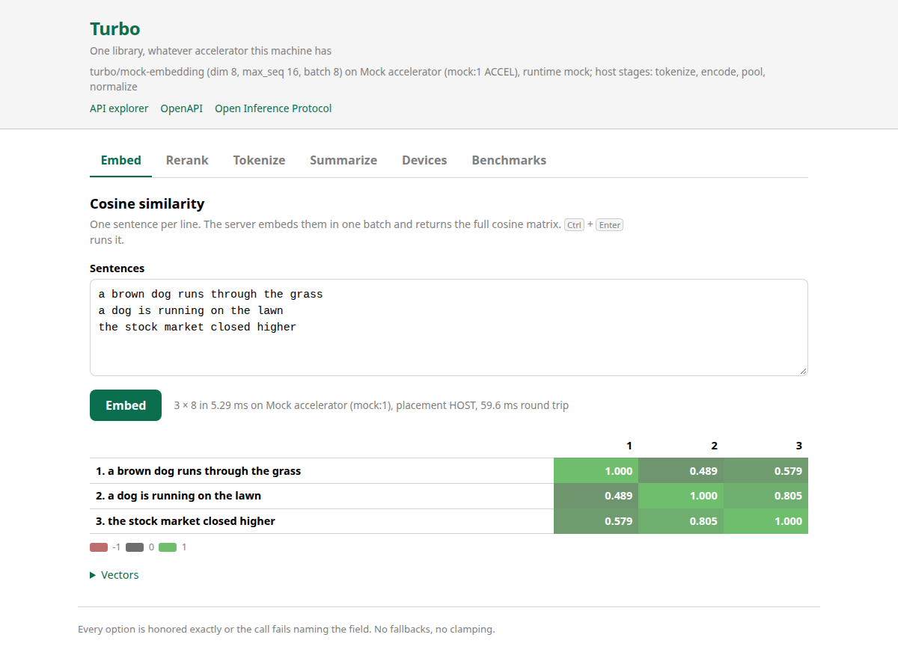
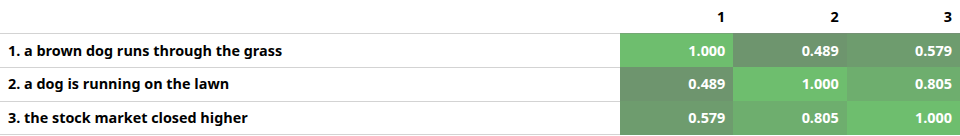
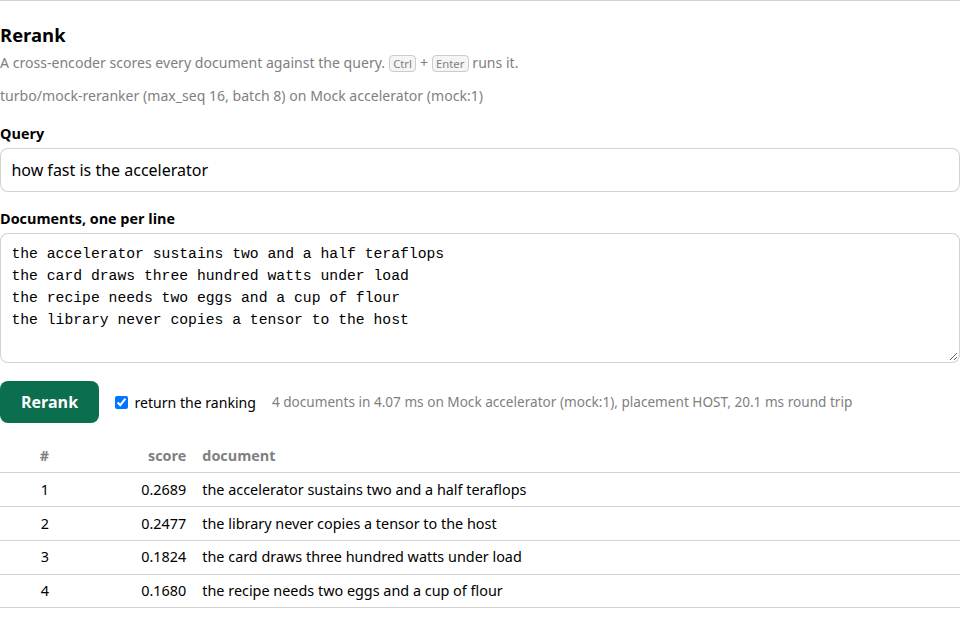
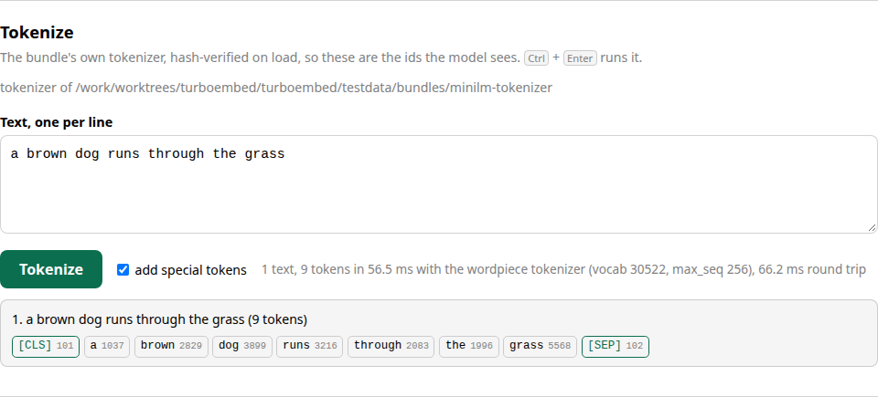
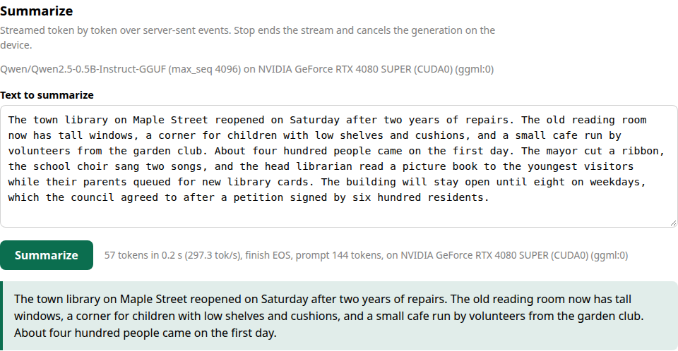
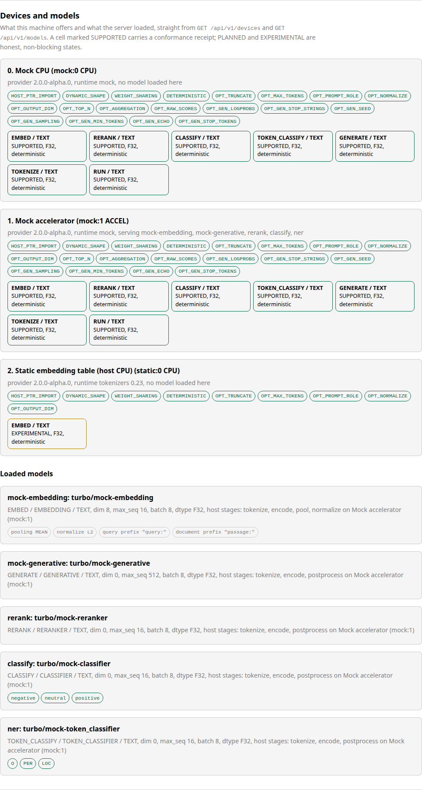
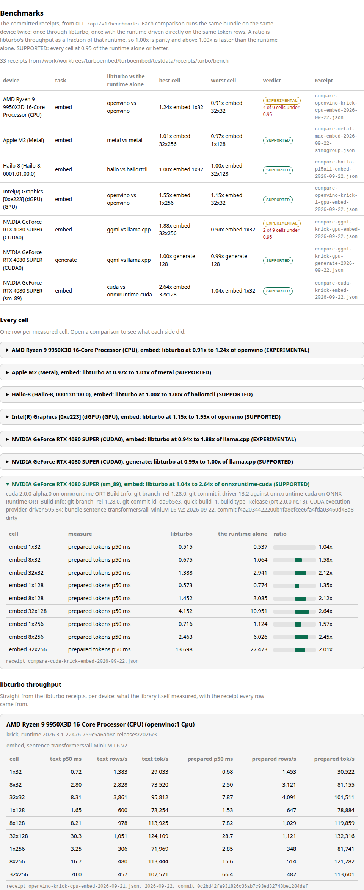

# Turbo inference server (Spring Boot)

A working inference server over `libturbo` through its JDK 25 FFM binding
(`bindings/java`, `ai.pipestream.turbo`). It serves several bundles at once
and exposes them twice:

- `/api/v1`, libturbo's own surface: per-call options that are honored
  exactly or refused by name, the device survey with the capability matrix,
  the whole `turbo_model_info` contract, per-phase timings and the output's
  memory placement.
- `/v2`, the KServe Open Inference Protocol version 2 HTTP/REST binding, for
  clients that already speak it. No gRPC; a separate Rust server is planned
  for that.

A page at `/` drives the same API from a browser, and `/swagger-ui.html`
renders the OpenAPI document at `/v3/api-docs`.

Nothing in this server falls back. Every libturbo refusal reaches the client
with its `TURBO_E_*` status name and the 1-based index of the field the
library named; no option is ignored, clamped or substituted.



## Running

```sh
cargo build -p turbo-shared                # target/debug/libturbo.so
demo/java-web-spring/run.sh                # the mock embedding bundle, port 8080
```

`run.sh` builds the Java binding and this app with Maven, then starts it with
`--enable-native-access=ALL-UNNAMED` and `-Dturbo.library=<libturbo.so>`. Set
`TURBO_LIBRARY` to use a library from somewhere else, and
`TURBO_WEB_SKIP_BUILD=1` to skip the Maven steps when the jar is already
built.

On the mock bundles the server needs no accelerator and no downloads, and
every number it returns is deterministic.

### Real bundles

One embedding model on an Intel GPU through OpenVINO:

```sh
demo/java-web-spring/run.sh \
    --turbo.bundle=$HOME/opt/bundles/minilm-onnx \
    --turbo.provider-lib=build/openvino/libturbo_provider_openvino.so \
    --turbo.provider=openvino --turbo.ordinal=1
```

One embedding model on an NVIDIA GPU through the CUDA provider:

```sh
cargo build -p turbo-provider-cuda
demo/java-web-spring/run.sh \
    --turbo.bundle=$HOME/opt/bundles/minilm-onnx \
    --turbo.provider-lib=target/debug/libturbo_provider_cuda.so \
    --turbo.provider=cuda --turbo.ordinal=0
```

A GGUF model through the ggml provider, streamed by the Summarize panel:

```sh
cargo build -p turbo-provider-ggml
demo/java-web-spring/run.sh \
    --turbo.bundle=$HOME/opt/bundles/minilm-onnx \
    --turbo.provider-lib=target/debug/libturbo_provider_cuda.so --turbo.provider=cuda \
    --turbo.generate-bundle=$HOME/opt/bundles/qwen05-gguf \
    --turbo.generate-provider-lib=target/debug/libturbo_provider_ggml.so \
    --turbo.generate-provider=ggml --turbo.generate-ordinal=0
```

An embedder, a reranker and a generator on one server:

```sh
demo/java-web-spring/run.sh \
    --turbo.bundle=$HOME/opt/bundles/minilm-onnx \
    --turbo.provider-lib=target/debug/libturbo_provider_cuda.so --turbo.provider=cuda \
    --turbo.models[0].name=rerank \
    --turbo.models[0].bundle=$HOME/opt/bundles/rerank-onnx \
    --turbo.models[0].provider=cuda \
    --turbo.generate-bundle=$HOME/opt/bundles/qwen05-gguf \
    --turbo.generate-provider-lib=target/debug/libturbo_provider_ggml.so \
    --turbo.generate-provider=ggml
```

`GET /api/v1/models` lists what loaded and under what name. Provider
runtimes (OpenVINO, CUDA, the ggml backends) come from `LD_LIBRARY_PATH` as
usual; see `docs/providers.md` for what each machine can build and
`docs/bundles.md` for importing a model.

## Configuration

A model is either an entry of the `turbo.models` list or one of the two
single-model shorthands. Both forms are additive and may be combined:
`turbo.bundle` adds one model, `turbo.generate-bundle` adds another, and
every `turbo.models[i]` entry adds one more. A name that collides fails
startup rather than shadowing a model.

| key | default | what it does |
|---|---|---|
| `turbo.bundle` | none | Bundle directory for the shorthand model. |
| `turbo.name` | the `model_id`'s last segment | The name this model is served under. |
| `turbo.provider-lib` | none | Provider library to load (`libturbo_provider_*.so`). |
| `turbo.provider` | empty | Provider id for an explicit device; empty means `AUTO`, which never selects a CPU. |
| `turbo.ordinal` | `0` | Device ordinal within that provider. |
| `turbo.sessions` | `2` | Sessions in the pool; a request that finds none free within 200 ms is refused with 503. |
| `turbo.max-batch` | `0` | Batch width per session; `0` is the bundle's own `limits.max_batch`. |
| `turbo.tokenizer-bundle` | the model's own bundle | Bundle whose `tokenizer.json` serves `/api/v1/tokenize` for this model. |
| `turbo.generate-bundle` | none | Bundle directory for the generative shorthand model. |
| `turbo.generate-name` | the `model_id`'s last segment | The name the generative model is served under. |
| `turbo.generate-provider-lib`, `turbo.generate-provider`, `turbo.generate-ordinal` | as above | Device selection for the generative model. |
| `turbo.generations` | `2` | Concurrent generations allowed; beyond that a request is refused with 503. |
| `turbo.models[i].name` / `.bundle` / `.provider-lib` / `.provider` / `.ordinal` / `.sessions` / `.max-batch` / `.generations` / `.tokenizer-bundle` | as above | The same keys, per listed model. |
| `turbo.receipts` | `../../testdata/receipts/turbo/bench` | Directory the Benchmarks panel reads. A directory that is not there is a 404, never an empty answer. |
| `turbo.oip.server-name` | `turbo` | The `name` in `GET /v2`. |
| `turbo.oip.server-version` | `2.0.0-alpha.0` | The `version` in `GET /v2`. |
| `server.port` | `8080` | HTTP port. |

The library itself is found through the `turbo.library` system property or
the `TURBO_LIBRARY` environment variable, which is what `run.sh` sets.

The mock bundles declare a `mock` tokenizer with no `tokenizer.json`, so
`/api/v1/tokenize` needs `turbo.tokenizer-bundle` pointed at a bundle that
carries one (`testdata/bundles/minilm-tokenizer` is committed for that).

## REST API

Every response is JSON with snake_case fields. A refusal carries
`{"error": ..., "status": ..., "field": ..., "path": ...}`, where `status` is
the `TURBO_E_*` name and `field` the 1-based descriptor field index, both
present only when libturbo itself refused.

| status | when |
|---|---|
| 400 | The request is malformed, the batch is wider than the model's, or libturbo called an argument or enum invalid. |
| 404 | No model is served under that name. |
| 409 | No loaded model performs that task, or the named model performs a different one. |
| 422 | `TURBO_E_CAPACITY`: the request is well formed but past the model's contract. |
| 501 | `TURBO_E_UNSUPPORTED_OPTION` and the other `TURBO_E_UNSUPPORTED_*` codes: the device does not implement an option that was set. |
| 503 | Every session or generation slot of the model is in use. |
| 500 | The server or the bundle is at fault, for example a bundle with no `tokenizer.json`. |

Requests that omit `model` use the first loaded model that performs the task.

### GET /api/v1/health

```sh
curl -s localhost:8080/api/v1/health
# {"status":"ok","abi_version":2,"device_count":3,"models":["mock-embedding"]}
```

### GET /api/v1/devices

The discover-style survey: one entry per device of every loaded provider,
with its provider, runtime and driver versions, the `TURBO_CAP_*` option
bits it honors, and the full task-by-modality capability matrix.

```sh
curl -s localhost:8080/api/v1/devices | jq '.[1] | {name, provider_id, features, offered: [.capabilities[] | select(.status != "UNSUPPORTED") | "\(.task)/\(.modality) \(.status)"]}'
```

### GET /api/v1/models, GET /api/v1/models/{name}

The whole `turbo_model_info` contract per loaded model: task, kind, modality,
dimension, labels, pooling, normalization, `max_seq`, `max_batch`, compute
dtype, `fully_accelerated`, the per-stage placement map, vocabulary size,
model id and revision, tokenizer hash and the bundle's prompt prefixes.

```sh
curl -s localhost:8080/api/v1/models
curl -s localhost:8080/api/v1/models/mock-embedding
```

### GET /api/v1/benchmarks

The committed receipts under `turbo.receipts`, in three groups. `comparisons`
is one entry per `compare-*.json`: the device, the libturbo provider and its
runtime, the runtime the reference program drove directly, the bundle, both
sides' dates and commits, every matched cell with its ratio, and the verdict.
`turbo` is one entry per libturbo receipt and `native` one per direct-native
receipt, each with the embed cells, the rerank cell and the generation cell it
carries.

```sh
curl -s localhost:8080/api/v1/benchmarks | jq '.comparisons[] | {device, task, verdict, best: ([.cells[].ratio] | max)}'
```

Nothing is computed here. A figure a receipt does not carry is absent rather
than defaulted, and a `turbo.receipts` that is not a directory, or that holds
no receipt, is a 404 naming the path.

### POST /api/v1/embed

```sh
curl -s localhost:8080/api/v1/embed -H 'content-type: application/json' -d '{
  "texts": ["a brown dog runs through the grass", "the stock market closed higher"],
  "options": {"truncate": "RIGHT", "max_tokens": 16, "prompt_role": "QUERY",
              "normalize": "L2", "pooling": "MEAN", "output_dim": 4}
}'
```

Options are `truncate`, `max_tokens`, `prompt_role`, `normalize`, `pooling`,
`output_dim` and `output_dtype`; anything left out is the bundle's contract.
An option the device does not advertise is refused:

```sh
curl -s -i localhost:8080/api/v1/embed -H 'content-type: application/json' \
    -d '{"texts":["a"],"options":{"pooling":"CLS"}}'
# HTTP/1.1 501
# {"error":"TURBO_E_UNSUPPORTED_OPTION (field 6): option `pooling` is not honored ...",
#  "status":"TURBO_E_UNSUPPORTED_OPTION","field":6,"path":"/api/v1/embed"}
```

### POST /api/v1/similarity

The same call plus the n by n cosine matrix, which is what the heat map draws.

```sh
curl -s localhost:8080/api/v1/similarity -H 'content-type: application/json' \
    -d '{"texts":["a brown dog","a dog on the lawn","the stock market"]}' | jq .similarity
```



### POST /api/v1/rerank

```sh
curl -s localhost:8080/api/v1/rerank -H 'content-type: application/json' -d '{
  "model": "rerank",
  "query": "how fast is the accelerator",
  "documents": ["the accelerator sustains two and a half teraflops",
                "the recipe needs two eggs and a cup of flour"],
  "options": {"top_n": 2, "return_sorted": true, "raw_scores": false}
}'
```

Scores come back in input order; `sorted` holds the document indexes best
first when `return_sorted` or `top_n` was set, and each hit carries its
`rank`. Both are gated by `TURBO_CAP_OPT_TOP_N`, and `raw_scores` by
`TURBO_CAP_OPT_RAW_SCORES`.



### POST /api/v1/classify

```sh
curl -s localhost:8080/api/v1/classify -H 'content-type: application/json' \
    -d '{"model":"classify","texts":["the service was excellent"],"options":{"raw_scores":false}}'
```

Returns the bundle's own label set with a score per label, ordered best
first, plus the `top` label per row.

### POST /api/v1/token-classify

```sh
curl -s localhost:8080/api/v1/token-classify -H 'content-type: application/json' \
    -d '{"model":"ner","texts":["Ada Lovelace worked in London"],"options":{"aggregation":"SIMPLE"}}'
```

Returns the spans the provider aggregated, each with byte offsets into its
input text, the slice those offsets name, the label and the score, plus the
shape of the raw `[batch, seq, labels]` score tensor. `aggregation` is gated
by `TURBO_CAP_OPT_AGGREGATION`.

### POST /api/v1/tokenize, POST /api/v1/detokenize

```sh
curl -s localhost:8080/api/v1/tokenize -H 'content-type: application/json' \
    -d '{"texts":["a brown dog"],"add_special_tokens":true}'
# ids [101,1037,2829,3899,102], mask, the decoded piece of every id, and the count

curl -s localhost:8080/api/v1/detokenize -H 'content-type: application/json' \
    -d '{"ids":[[101,1037,2829,3899,102]],"skip_special_tokens":true}'
```

The tokenizer is the one the bundle declares, hash-verified on load, so these
are the ids the model sees. Byte offsets are not returned: the Java binding's
`Tokenizer.encode` does not pass an offsets buffer to
`turbo_tokenizer_encode`, so this server has none to report and does not
invent any.



### POST /api/v1/generate

```sh
curl -s localhost:8080/api/v1/generate -H 'content-type: application/json' -d '{
  "messages": [{"role": "system", "content": "You summarize text."},
               {"role": "user", "content": "The town library reopened on Saturday."}],
  "options": {"max_tokens": 128, "temperature": 0.7, "top_p": 0.95, "top_k": 40,
              "seed": 1234, "stop": ["\n\n"], "logprobs": 1}
}'
```

Give `prompt` (a single user turn) or `messages` (a chat rendered through the
bundle's own chat template), not both. The response carries the whole text,
the finish reason, `usage` and the timings. Each sampling parameter is gated
by a `TURBO_CAP_OPT_GEN_*` bit.

### POST /api/v1/generate/stream

```sh
curl -sN localhost:8080/api/v1/generate/stream -H 'content-type: application/json' \
    -d '{"prompt":"Summarize: the library reopened on Saturday.","options":{"max_tokens":32}}'
# event:chunk
# data:{"text":"tok417 ","tokens":[417],"generated":1}
#
# event:done
# data:{"finish_reason":"LENGTH","generated_tokens":32,"prompt_tokens":11,...}
```

One `chunk` event per generation step, then a single `done` event with the
finish reason, the token counts, the whole text and the timings. A failure
after the headers are sent cannot change the status code, so it arrives as an
`error` event carrying the library's status name and field index, and the
stream then ends. A client that disconnects cancels the generation on the
device: the next step reports `CANCELLED` and the slot is freed.



## Open Inference Protocol v2

The endpoints are the six of the protocol's **HTTP/REST** section, with the
optional version-qualified path forms:

| API | verb | path |
|---|---|---|
| Server Metadata | GET | `/v2` |
| Server Live | GET | `/v2/health/live` |
| Server Ready | GET | `/v2/health/ready` |
| Model Metadata | GET | `/v2/models/{name}` and `/v2/models/{name}/versions/{version}` |
| Model Ready | GET | `/v2/models/{name}/ready` and `/v2/models/{name}/versions/{version}/ready` |
| Inference | POST | `/v2/models/{name}/infer` and `/v2/models/{name}/versions/{version}/infer` |

Bodies follow the **Server Metadata Response JSON Object**, **Model Metadata
Response JSON Object**, **Inference Request JSON Object** and **Inference
Response JSON Object** sections, with tensor contents flattened row-major per
the **Tensor Data** section and datatypes drawn from **Tensor Data Types**
(`BYTES` for text, `FP32` for vectors and scores, `INT32` for ids). Failures
use the **Inference Response JSON Error Object** shape, `{"error": "..."}`,
with 400 for a request the model cannot take, 404 for a name or version this
server does not serve, and 500 for a server or device failure. The
specification is
`https://kserve.github.io/website/latest/modelserving/data_plane/v2_protocol/`,
whose source is
`kserve/open-inference-protocol`, `specification/protocol/inference_rest.md`.

Two notes on this implementation. Every model is served under version `1`,
and any other version is 404. The specification's Server Ready Response JSON
Object names its only field `live`; this server sends `live` and `ready`
together, which carry the same answer.

### Mapping

| model kind | request inputs | response outputs | request `parameters` |
|---|---|---|---|
| embedding | `text` BYTES `[batch]` | `embeddings` FP32 `[batch, dim]` | `truncate`, `max_tokens`, `prompt_role`, `normalize`, `pooling`, `output_dim`, `output_dtype` |
| reranker | `query` BYTES `[1]`, `documents` BYTES `[batch]` | `scores` FP32 `[batch]`, `sorted` INT32 `[top_n]` when asked for | `truncate`, `max_tokens`, `top_n`, `return_sorted`, `raw_scores` |
| classifier | `text` BYTES `[batch]` | `scores` FP32 `[batch, labels]`, `labels` BYTES `[labels]` | `truncate`, `max_tokens`, `raw_scores` |
| token classifier | `text` BYTES `[batch]` | `scores` FP32 `[batch, max_seq, labels]`, `labels` BYTES `[labels]` | `truncate`, `max_tokens`, `aggregation`, `raw_scores` |
| generative | `prompt` BYTES `[1]` or `messages` BYTES `[turns]`, each turn a JSON object with `role` and `content` | `text` BYTES `[1]` | `max_tokens`, `min_tokens`, `temperature`, `top_p`, `top_k`, `min_p`, `seed`, `stop`, `logprobs`, `echo` |

The response `parameters` object carries what the protocol's tensors cannot:
`placement` and `total_ms` for the session tasks, and `finish_reason`,
`prompt_tokens`, `generated_tokens` and `total_ms` for a generation. An
`outputs` list in the request narrows the response to the named tensors, in
the order asked for; a name the model does not produce is a 400.

```sh
curl -s localhost:8080/v2
curl -s localhost:8080/v2/health/ready
curl -s localhost:8080/v2/models/mock-embedding
curl -s localhost:8080/v2/models/mock-embedding/ready

curl -s localhost:8080/v2/models/mock-embedding/infer -H 'content-type: application/json' -d '{
  "id": "req-1",
  "inputs": [{"name": "text", "shape": [2], "datatype": "BYTES",
              "data": ["a brown dog", "the stock market"]}]
}'
# {"model_name":"mock-embedding","model_version":"1","id":"req-1",
#  "parameters":{"placement":"HOST","total_ms":0.33},
#  "outputs":[{"name":"embeddings","shape":[2,8],"datatype":"FP32","data":[...]}]}

curl -s localhost:8080/v2/models/rerank/infer -H 'content-type: application/json' -d '{
  "inputs": [{"name": "query", "shape": [1], "datatype": "BYTES", "data": ["fast accelerator"]},
             {"name": "documents", "shape": [2], "datatype": "BYTES",
              "data": ["the accelerator is fast", "a pot of soup"]}],
  "parameters": {"return_sorted": true}
}'

curl -s localhost:8080/v2/models/mock-generative/infer -H 'content-type: application/json' -d '{
  "inputs": [{"name": "messages", "shape": [2], "datatype": "BYTES",
              "data": ["{\"role\":\"system\",\"content\":\"be terse\"}",
                       "{\"role\":\"user\",\"content\":\"hello\"}"]}],
  "parameters": {"max_tokens": 32}
}'
```

## OpenAPI

`springdoc-openapi` serves the document at `/v3/api-docs` and renders it at
`/swagger-ui.html`. Every endpoint carries a summary, a description of what
it refuses and why, a schema for its request and response, and at least one
worked example.

```sh
curl -s localhost:8080/v3/api-docs | jq '.paths | keys'
```

## The page

Dependency-free static HTML, CSS and JavaScript with no build step, served
from `src/main/resources/static`. Six panels behind one tab bar: Embed (the
cosine heat map), Rerank, Tokenize, Summarize (the streamed generation),
Devices (the survey and the loaded contracts) and Benchmarks (the committed
receipts). Every call shows the device it ran on, the server-side time, the
output placement and the round trip.

The tab bar follows the ARIA tabs pattern: arrow keys, Home and End move
between tabs, only the selected tab is in the tab order, and each panel is
focusable. `Ctrl` + `Enter` in any input runs that panel. A tab whose task no
loaded model performs is disabled and says which flag would enable it.



## Benchmarks

The Benchmarks panel draws `GET /api/v1/benchmarks`, so a visitor can see how
libturbo did against the runtime it sits on, per device, without leaving the
page. It needs no accelerator: the numbers are the receipts committed under
`testdata/receipts/turbo/bench`, each one taken on the machine it names.

The panel has three parts:

- a summary table, one row per comparison, with the device, the task, the
  libturbo provider against the runtime the reference program drove directly,
  the best and the worst cell, the verdict, and the receipt file the row came
  from. A comparison with cells under the floor says how many.
- every cell of a comparison, one expandable table each: the measure, both
  sides' figures, and the ratio as a bar centered on 1.00x, so a cell above and
  a cell below the runtime alone are told apart at a glance. Cells under the
  floor are marked.
- the libturbo throughput per device, straight from the `benchmark` receipts:
  p50, rows per second and tokens per second for each batch by sequence-length
  cell on both the text path and the prepared-tokens path, the rerank cell's
  documents per second (a rerank cell carries no token count), and the
  generation cell's time to first token, decode rate and total. A figure the
  receipt does not carry reads "none" rather than a zero.

A ratio is libturbo's throughput as a fraction of that runtime's, which the
panel words as "libturbo at 1.58x of onnxruntime-cuda": 1.00x is parity and
above 1.00x is faster than the runtime alone. The verdict rule is stated once,
at the top of the panel: SUPPORTED means every cell reached 0.95 of the runtime
alone or better with nothing unmatched, and a comparison that did not reach it
is EXPERIMENTAL. `crates/turbo-bench` writes both sides and the verdict; the
protocol is [`reference/README.md`](../../reference/README.md) and
[`PLAN.md`](../../PLAN.md) section 11.



## Tests

```sh
mvn -f demo/java-web-spring/pom.xml test        # 75 cases, MockMvc, the mock bundles
```

Ten classes over one server built from the five committed mock bundles:
`MetaApiTest`, `EmbedApiTest`, `RerankApiTest`, `ClassifyApiTest`,
`TokenizeApiTest`, `GenerateApiTest`, `BenchmarkApiTest`, `OipTest`,
`ServerSurfaceTest` and `ConfigurationTest`. They cover every endpoint and the
refusals each one is
documented to produce: an unknown model name (404), a model of another task
(409), an unknown enum constant (400 naming the field and what it accepts), a
request past the model's contract (422 with `TURBO_E_CAPACITY` and the field
index), an option the device does not implement (501 with
`TURBO_E_UNSUPPORTED_OPTION` and field 6), a bundle with no `tokenizer.json`
(500 with `TURBO_E_BUNDLE_INVALID`), a mid-stream failure as an SSE `error`
event, and a sink that stops a generation, which is the path a disconnected
client takes.

`BenchmarkApiTest` reads the committed receipts through the endpoint: the three
groups, both sides of a comparison, the cells under the floor, the embed, rerank
and generation figures, and the fields a receipt leaves out staying absent.
`BenchmarkReceiptsDirectoryTest` points `turbo.receipts` at a directory with no
receipt and at one that does not exist, and insists on a 404 naming the path
rather than an empty answer.

The browser and protocol suite is `e2e/` (Playwright, 50 cases); see
`e2e/README.md` for running it and for regenerating the screenshots.
