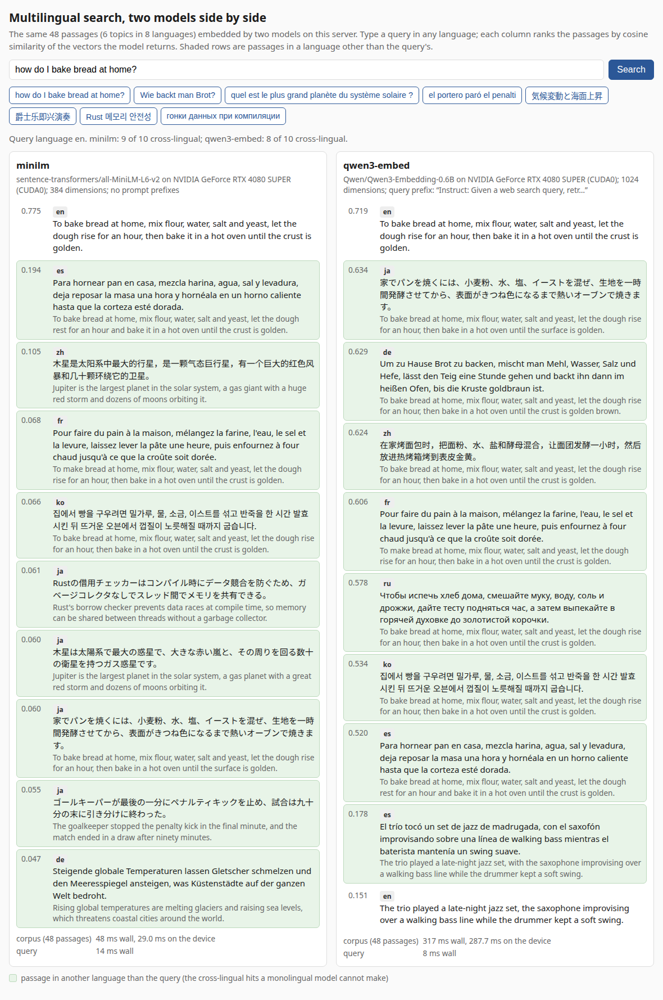

# Multilingual search: two embedding models side by side

One page, served by Inferstream itself, that embeds the same 48 passages
(6 topics in 8 languages: en, de, fr, es, ru, ja, zh, ko) with two
served models and ranks them for a query typed in any language. Each
column is one model; the shaded rows are passages in a language other
than the query's, the cross-lingual hits a monolingual model cannot
make.



## Run

```sh
cargo build -p turbo-inferstream
target/debug/inferstream \
    --provider-lib target/release/libturbo_provider_ggml.so \
    --model "name=minilm,bundle=$HOME/opt/bundles/minilm-gguf,provider=ggml,buckets=1x256;8x256;32x256" \
    --model "name=qwen3-embed,bundle=$HOME/opt/bundles/qwen3-embed-gguf,provider=ggml,buckets=1x512;8x512;32x512" \
    --pages demo/search
# then open http://127.0.0.1:8000/
```

`--pages` serves the directory's files at `/` next to the API (only
regular files under it; a path that resolves outside is 404). The page
reads `/info` for the served embedding models and their prompt
prefixes, embeds `corpus.json` with each through `/v1/embeddings`
(with `prompt_role: document` only for a model whose bundle declares a
document prefix, since the server rejects the option otherwise), and
ranks by cosine in the browser. `?models=a,b` picks two served models
by name; the default is the first two embedding models.

## Bundles

MiniLM is `~/opt/bundles/minilm-gguf` (all-MiniLM-L6-v2 as GGUF,
WordPiece, mean pooling, 384 dimensions, English). Qwen3-Embedding-0.6B
is imported from the Q8_0 GGUF and the model's tokenizer and
sentence-transformers files:

```sh
turbo-bundle import --source ~/opt/models/qwen3-embed-0.6b \
    --output ~/opt/bundles/qwen3-embed-gguf --license Apache-2.0 \
    --model-id Qwen/Qwen3-Embedding-0.6B --kind embedding --max-seq 512 \
    --artifact gguf=$HOME/opt/models/qwen3-embed-0.6b-gguf/Qwen3-Embedding-0.6B-Q8_0.gguf
```

The importer records the byte-level BPE tokenizer (`kind: bpe`, read by
the core's native tokenizer), last-token pooling from
`1_Pooling/config.json`, and the query instruction from
`config_sentence_transformers.json`, which the page sends as
`prompt_role: query`.

## What it shows (RTX 4080 SUPER host, 2026-09-22)

Eight queries, one per language, the top 8 of 48 passages per model:

| query | MiniLM: same topic in the top 8 | Qwen3-Embedding: same topic in the top 8 |
|---|---|---|
| en: how do I bake bread at home? | 5 | 8 |
| de: Wie backt man Brot? | 2 | 8 |
| fr: quelle est la plus grande planète du système solaire ? | 3 | 8 |
| es: el portero paró el penalti | 2 | 8 |
| ru: гонки данных при компиляции | 1 (top hit is the wrong topic) | 8 |
| ja: 気候変動と海面上昇 | 2 | 8 |
| zh: 爵士乐即兴演奏 | 2 | 8 |
| ko: Rust 메모리 안전성 | 3 | 8 |

Embedding the 48 passages: MiniLM 134 ms (384 dimensions), Qwen3
502 ms (1024 dimensions), both through `ggml` on the 4080. The
`demo/search/corpus.json` passages are short and the topics are far
apart, so this is an illustration of cross-lingual retrieval, not a
benchmark of retrieval quality.
