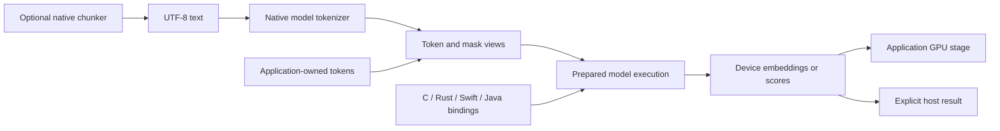

# TurboEmbed library definition

Design direction, 2026-09-13. This describes the intended library; it does not
claim the proposed APIs or performance guarantees already exist. Delivery gates
are in the [roadmap](../ROADMAP.md), and current defects are in the
[code review](code-review-2026-09-13.md).

Current implementation and usage are maintained in the [native SDK guide](native-sdk.md),
with linked Rust/Java guides and dated validation receipts. The planning baseline
below does not serve as a current feature-status list.

## Purpose

TurboEmbed provides native embedding and reranking execution inside the caller's
process. Applications should be able to use their GPU directly, control memory
and scheduling, and receive model-correct results with minimal overhead above
the underlying native implementation. C, C++, Rust, Swift, and Java callers
should reach the same execution path without requiring a server.

Universal means a common contract across supported hardware and languages.
Providers expose their actual models, data types, memory placements, and
execution capabilities. Unsupported combinations return explicit errors. A
common API does not imply that every model or optimization exists on every GPU.

TurboEmbed remains the embedding surface, TurboRerank the reranking surface, and
TurboBuffer their shared memory infrastructure. Inferstream is an optional
server over the libraries. Existing generation code remains supported in its
current scope; a universal generation API is a separate future undertaking.

## What getting close to the hardware means

The library owns its execution and memory contract: model preparation, input
layout, reusable workspaces, synchronization, pooling, and result lifetime.
It may use vendor runtimes and optimized kernels where they expose the required
controls. Runtime selection is based on measured execution behavior, available
buffer integration, and model support.

Intel OpenVINO is the confirmed first correctness and performance baseline,
using compiled models and supported device-memory integration directly in process.
NVIDIA follows with ORT's C interfaces and CUDA kernels; Apple follows with its
existing MLX and Metal implementation. Keep each runtime a
provider dependency. The public API must not require users to construct that
runtime's high-level objects or reproduce its application framework.

Replace a runtime operation with a lower-level kernel when profiling identifies
a material cost and equivalent model behavior is demonstrated. Kernel fusion,
graph replay, packing, precision changes, and batch scheduling each require a
measured gain. Rewriting every operator is not a prerequisite for the library.

Use the fastest correct transfer strategy for the workload. Mapped host memory
can still cause device/host traffic; an explicit asynchronous copy can outperform
repeated remote reads. A zero memcpy counter alone cannot select the winner.

## Two public paths

**Text path.** Load a model once, submit UTF-8 text or text pairs, and obtain
embeddings or scores. Model-specific tokenization, required prefixes, special
tokens, padding, truncation, pooling, and normalization are applied consistently.
Convenience allocation is permitted but measurable; callers can reuse a request
and output capacity. Chunking is a separate optional operation.

**Prepared-input path.** Applications supply token IDs, masks, and other inputs
required by a supported model, along with reusable output/workspace buffers.
They can request host results or retain device results for a following GPU stage.
This path bypasses text conversion and tokenization. Callers explicitly declare
that their tokens match the loaded model's tokenizer contract; the library still
validates sizes, layouts, data types, device compatibility, and required inputs.

Both paths share model execution and postprocessing. There is no mandatory
protobuf, JSON, HTTP, model download, or language-level tensor reconstruction
inside a prepared inference call.

Within declared shape and concurrency limits, warmed prepared calls must reuse
TurboEmbed buffer and workspace storage. Request/completion bookkeeping should
also be reusable. Provider and language-runtime allocations are counted
separately; report them instead of extending an arena-only result into a claim
of zero allocations everywhere.

Conceptual flow, not new symbol names:

## Execution and memory contract

The advanced API needs these concepts before its C declarations are finalized:

- **Device context:** concrete device identity, provider identity, memory budget,
  capabilities, and any supported external context/queue integration. AUTO
  retains the existing GPU-only policy; discovery exposes the resolved device.
- **Prepared model:** immutable model identity and execution configuration,
  including precision, tokenizer fingerprint, pooling, normalization, accepted
  shapes, and query/document roles. Different compiled shape profiles are
  explicit resources, not unexpected recompilations in a timed call.
- **Execution slot:** request-local mutable workspace and submission state.
  Separate slots enable concurrency without racing scratch buffers. Do not
  assume immutable weights can be shared until the provider supports it.
- **Buffer view:** element type, shape, strides with defined units, byte capacity,
  alignment, placement, device/context identity, and ownership. Support i32/i64
  tokens where needed; retain FP32 as the initial result contract. Other
  precisions are capabilities with separate parity gates.
- **Completion:** a synchronous call returns usable results; an asynchronous
  submission returns a completion object. Enqueue time and completion time are
  different measurements. Waiting is scoped to the request where possible.
- **Ownership:** owned allocations, borrowed external buffers, and leased results
  have distinct release rules. Borrowed inputs remain valid until completion.
  Closing an owner must wait, reject while busy, or defer destruction; it must
  never leave usable handles pointing to freed storage.

An opaque handle is not permission to cast a CUDA allocation into a host pointer.
Device results are exposed as device resources; obtaining a host view requires
a supported mapping or explicit readback and synchronization. Foreign runtime
buffers can only be imported when their context and ownership are compatible.
Unsupported imports return an error instead of silently staging through the CPU.

The first prepared path can be synchronous and use library-owned resources.
External stream import and asynchronous submission follow once lifecycle rules
are proven. Public capability discovery distinguishes these steps.

Do not change ABI v1 layouts in place. The existing text entry points remain
compatible. New descriptors require explicit version/size negotiation, unknown
field and enum behavior, symbol visibility, and ownership documentation. Decide
between additive versioned functions and a separate ABI revision in a focused
design change. The existing reserved provider vtable lacks a complete lifecycle
and capability contract; its presence does not settle the extension design.

## Tokenization, chunking, and future analysis

Model tokenization is part of embedding correctness. Each supported text model
must have an exact native tokenizer or explicitly report text input unsupported
while allowing valid prepared tokens. Do not return mock tokens for real models.
The current optimized WordPiece implementation needs the fixes and reference
comparisons identified in the review before broader use.

Initial chunking can run in compiled Rust or C++. Start with deterministic
paragraph boundaries and a token-budget limit, optionally preferring sentence
boundaries. Reserve space for model prefixes and special tokens. Long spans
must split even without punctuation, with explicit overlap and a forward-progress
guarantee. Return half-open UTF-8 byte offsets into the original input, source
identity, and chunking configuration. Java adapters convert offsets to UTF-16
only when requested; normalization must preserve an offset map if it changes text.

The existing [E2E chunker](../crates/e2e/src/chunker.rs) is a useful test utility:
it normalizes text, allocates strings, and lacks model token budgets and original
offsets. It is not yet the library chunking contract. Prefer a small native
implementation first; evaluate a dependency only if it provides a needed
language feature with acceptable size, licensing, and offset behavior.

GPU tokenization, GPU sentence segmentation, and richer analysis are deferred
capabilities. Their initial stubs report unsupported. Use native CPU preprocessing
as an explicit pipeline choice and measure its cost separately from GPU model
execution. Benchmark batching and overlap with inference before choosing GPU
preprocessing, especially for small requests.

CPU preprocessing is distinct from CPU execution of model operators. Report
provider graph partitioning and host operations; a GPU-only model-execution
claim must not conceal partial CPU inference.

The planned OpenNLP expansion is a later integration track. TurboEmbed supplies
embedding/reranking execution through our Java adapters; OpenNLP owns its analysis
features and model semantics. Integration must remain optional so the base
OpenNLP distribution need not acquire GPU runtimes, this native library, or new
mandatory analysis dependencies. Its existing dependency policy is a constraint
provided by the project owner, not an audited dependency inventory here.

FFM/JNI bindings do not automatically compile Java analysis implementations to
native code. Porting analysis algorithms, exporting model execution, or using a
native-image approach are separate decisions. Keep native/GPU analysis as a
defined extension point until a concrete feature and model justify that work.

## Language bindings and distribution

The C ABI is the interoperability boundary. C++ adds RAII; Rust enforces borrowing
or retained ownership; Swift enforces task/thread and resource lifetimes. Java
targets JDK 25+ on desktop through Panama FFM, with a JNI adapter for Android
in a later phase. Keep FFM types out of any API shared with Android. Resolve
the adapter once at session creation;
neither discovery nor reflection belongs in each inference call.

The modern Java mechanism is **Project Panama's Foreign Function & Memory API**.
It provides native downcalls and memory access. JNI is planned for Android;
older desktop JVMs are outside the initial scope. Neither mechanism is inherently a promise
of low end-to-end overhead: string encoding, allocations, copies, scheduling,
and synchronization all require measurement.
[Oracle FFM documentation](https://docs.oracle.com/en/java/javase/25/core/foreign-function-and-memory-api.html),
[Android JNI guidance](https://developer.android.com/ndk/guides/jni-tips).

Java should offer ordinary text/array convenience and reusable native-buffer
operations. Use deterministic close semantics, standard UTF-8, and coarse batch
calls. Avoid per-token JNI calls and per-element result conversion on the
prepared path. Cancellation does not release native resources until work has
actually completed. A gRPC adapter is optional and explicitly remote.

Distribute a small common API plus the selected native provider artifacts,
identified by OS, architecture, accelerator/runtime compatibility, and ABI.
Users should not need all vendor SDKs. Native consumers must be able to link
and run outside the source checkout. Model bundles are separately prepared,
pinned, verified, and loaded offline. Download tooling is outside inference and
may later serve OpenNLP model provisioning through an optional integration.

## Native performance acceptance

Measure three boundaries with identical model revision, precision, inputs,
pooling, shapes, device, and synchronization:

1. Direct provider/runtime execution with equivalent reusable memory and
   postprocessing, bypassing the TurboEmbed public API.
2. The public native ABI, using prepared tokens and output buffers.
3. Each language adapter over that ABI, with both prepared buffers and realistic
   text-to-result requests reported separately.

This distinguishes kernel/runtime cost from library overhead and binding cost.
Compare against an optimized direct baseline, not a deliberately allocating
example. Server comparisons, including TEI where equivalent, are separate
end-to-end experiments with matching batching and concurrency. They cannot
establish native binding overhead.

Initial engineering targets, to be calibrated once on the reference machine:
prepared ABI p50 within 5% of the matched native baseline and throughput at
least 95% of it; each managed adapter should add no more than 5 microseconds p50
and 20 microseconds p99 over the ABI in the bridge-isolation test. These are
targets, not measured achievements or universal timing guarantees. If a target
is unsuitable, document the pilot evidence and agree a replacement before the
optimization run, rather than relaxing it after a failed result.

Record wall-clock completion latency, device execution time, throughput, host
and device allocations, transfer bytes, synchronization, and resident memory.
Separate cold load/compile from warmed execution; count result records and
language objects separately from arena growth. Token IDs must match exactly;
vectors and rerank scores use model/precision-specific error and ranking gates.
Set tolerances before measuring. Cosine alone is insufficient evidence.

For the initial MiniLM pilot, cover batches 1/8/32 and token lengths 32/128/256,
including padded mixed-length batches, plus two independent engines. Use three
repeats per case, each capped at 10 seconds or 10,000 completed requests,
whichever comes first, after a declared warmup. Save samples and uncertainty;
insufficient samples produce an inconclusive tail claim. Cap each platform's
initial experiment at 30 minutes. Further runs require a specific unresolved
question and another finite plan.

ORT supports binding device inputs and outputs, and OpenVINO exposes native
resource/context integration. The exact installed versions and execution
restrictions must be checked during implementation; neither API proves that
our current path avoids copies.
[ORT I/O binding](https://onnxruntime.ai/docs/performance/tune-performance/iobinding.html),
[ORT device tensors](https://onnxruntime.ai/docs/performance/device-tensor.html),
[OpenVINO remote tensors and queue sharing](https://docs.openvino.ai/2026/openvino-workflow/running-inference/inference-devices-and-modes/gpu-device/remote-tensor-api-gpu-plugin.html).
