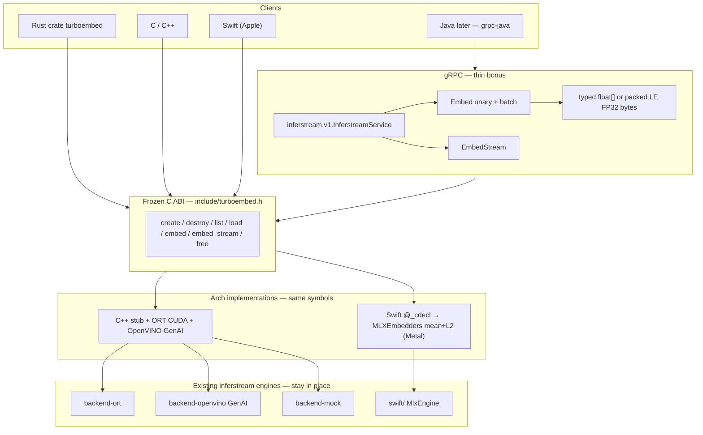

# TurboEmbed architecture

TurboEmbed is a **universal embedding API** layered on top of today's
inferstream engines. It does **not** replace the arch gRPC servers
(`inferstream-nvidia`, `inferstream-intel`, the Swift Apple server). Those
keep serving OIP V2 + `inferstream.v1`. TurboEmbed is the in-process ABI
every language can call, with gRPC as a thin bonus wrapper over the same
surface.

No Python. No JSON bridge. Pointer+length views on the wire between
languages.

## Layer cake



| Layer | Who owns it | Status in this scaffold |
|---|---|---|
| C header `include/turboembed.h` | Frozen ABI v1 | landed |
| C++ `native/turboembed` | nvidia / intel / Linux CI | `mock-embed` on explicit `MOCK`/`CPU` only; `--features ort-cuda` / `genai` wire real MiniLM. GPU request never silently becomes CPU or mock |
| Swift `@_cdecl` shim | Apple (same header) | **LIVE** — `libTurboEmbed.dylib` → `MlxEngine` mean+L2 on Metal |
| Rust `crates/turboembed` | safe zero-copy wrapper | ABI smoke + `mlx-live` / `ort-cuda` / `genai` receipts |
| gRPC `Embed` / `EmbedStream` | maps to existing InferstreamService | proto delta + server fill-in |
| inferstream arch servers | unchanged | do not rip out |

## ABI ownership rules

These are part of the contract, not style notes. Full text lives in the
header comment.

1. **Inputs are views.** `turboembed_str { ptr, len }` and `const char *` +
   `len` are borrowed. The caller keeps the allocation. Validity: the
   duration of the call only. UTF-8. Not necessarily NUL-terminated (except
   `config_path` and name helpers).
2. **Outputs are engine-owned.** `turboembed_embed_result` and
   `turboembed_model_info` lists are released with the matching
   `*_free`. Do not `free` inner pointers. Destroying the engine
   invalidates anything it allocated.
3. **Packed bytes alias typed floats.** The result's `values` (FP32
   row-major) and `packed` (little-endian byte view of the same buffer)
   share one allocation. Releasing the result releases both.
4. **Stream callback pointers die at return.** Copy the row inside
   `turboembed_stream_cb` if you need it later.
5. **One engine, one thread.** Distinct engines may run concurrently.
6. **No silent CPU.** GPU/Metal/AUTO/NPU requests fail if that
   accelerator is missing. `CPU` / `OPENVINO_CPU` only when selected.

Rust documents the same rules on `Engine` / `Embeddings`: the safe wrapper
never hands out a `&[f32]` that outlives the `Embeddings` guard.

## Provider plugin sketch

Real engines stay behind a vtable so we can add **model2vec** (or any other
encoder) without growing the public ABI.

```c
typedef struct turboembed_provider_vtbl {
    const char *id;          /* "ort", "openvino-genai", "mlx", "model2vec" */
    turboembed_status (*load)(void *ctx, const char *alias, size_t alias_len);
    turboembed_status (*embed)(void *ctx, const turboembed_str *texts,
                               size_t n, const turboembed_embed_options *opts,
                               turboembed_embed_result **out);
    void *ctx;
} turboembed_provider_vtbl;

turboembed_status turboembed_register_provider(const turboembed_provider_vtbl *);
```

Today `turboembed_register_provider` returns `NOT_IMPLEMENTED`. The stub
engine answers `mock-embed` itself.

Wiring map (do not invent a fourth runtime):

| Provider id | Host | Existing code to call later |
|---|---|---|
| `ort` | nvidia | `crates/backend-ort` (CUDA EP / CPU EP) |
| `openvino-genai` | intel | `crates/backend-openvino` `TextEmbeddingPipeline` |
| `mlx` | apple | `swift/Sources/MlxEngine` (`MLXEmbedders`) |
| `mock` | any | C++ stub (this repo) / `backend-mock` |
| `model2vec` | later | plugin only — not shipped |

Aliases stay the catalog names (`minilm`, `bge-small`, …). Clients never
learn which provider served the vector.

## gRPC surface

TurboEmbed does **not** add a second gRPC service. It maps onto the
existing [`inferstream.v1.InferstreamService`](../proto/inferstream_extension.proto)
`Embed` RPC — already a typed convenience over OIP `ModelInfer`.

| C ABI | gRPC | Notes |
|---|---|---|
| `turboembed_list_models` | `ListModels` | same catalog aliases |
| `turboembed_load_model` | *(startup `serve` / implicit)* | gRPC servers load at process start |
| `turboembed_embed` / `_one` | `Embed` | `texts[]` is already a batch |
| `turboembed_embed_stream` | `EmbedStream` | unary request, streamed rows |
| `values` (typed) | `EmbedResponse.embeddings[].values` | default `TYPED` |
| `packed` | `EmbedResponse.packed_embeddings` | `PACKED_BYTES` — LE FP32 `[n*d]` |

`EmbedRequest.output_format` selects typed **or** packed. Packed is the
cheap path for Java / Rust clients that want one `bytes` copy matching
OIP `raw_output_contents`. Default stays typed so today's grpcurl and
`inferstream-e2e` clients do not change.

OIP `ModelInfer` remains the interoperable raw-tensor path (BYTES `text`
in, FP32 `embedding` out). Every TurboEmbed embed is expressible as
`ModelInfer`.

## Java note

A future `turboembed-java` client is **grpc-java stubs generated from
`proto/inferstream_extension.proto`** — not JNI over the C ABI on day one.

- Unary: `InferstreamServiceGrpc.InferstreamServiceBlockingStub.embed`
- Batch: already `repeated string texts`
- Stream: `embedStream` → `Iterator<EmbedChunk>`
- Packed: set `output_format = PACKED_BYTES` and read
  `packed_embeddings` as a `ByteBuffer` (little-endian `float32`)

JNI / Panama over `turboembed.h` is optional later for in-process JVM
embedding (no socket). Do not start there; the gRPC path matches how Java
already talks to inferstream.

## What this scaffold does not do

- Does not rip out or stop the inferstream arch servers.
- **NVIDIA ORT CUDA is wired** (`--features ort-cuda`): IoBinding device
  buffers; a CUDA request never becomes CPU. Receipts:
  `nvidia-minilm.json` (CUDA) and `nvidia-minilm-cpu.json`.
- **Intel GenAI CPU and GPU are wired.** `--features genai` constructs
  `ov::genai::TextEmbeddingPipeline` with the official `"CPU"` or `"GPU"`
  string. A GPU request fails if the GPU plugin is missing (no silent
  CPU). Receipts: `intel-minilm.json` (GPU) and `intel-minilm-cpu.json`.
- **Apple MLX is wired** on macOS: `Device::Metal` / `Device::Auto` +
  `minilm` is FP mean+L2. Receipt: `apple-minilm.json`.
- Does not add Python bindings.

## Mock is smoke-only

`TURBOEMBED_DEVICE_MOCK` / `Device::Mock` (and the `mock-embed` / `mock`
aliases) exist for **ABI smoke**: create / list / load / embed / free of
an 8-d FNV vector. That path is never a silent substitute for a missing
Metal/GPU/ORT/GenAI provider.

Catalog aliases (`minilm`, `bge-*`, `e5-*`, …) on `AUTO` / `METAL` /
`CUDA` / `OPENVINO_*` must come from the real engine or **fail loud**.
A live/integration test that accepts `dim == 8` for those aliases is
wrong — it is asserting the mock.

Build the stub and the Rust smoke test: see the [root README](../README.md#turboembed)
and `native/turboembed/README.md`.
