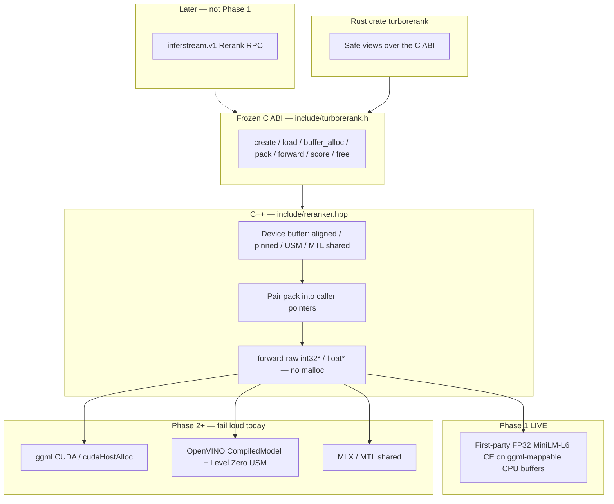

# TurboRerank architecture (Phase 1)

TurboRerank is the **library-first** cross-encoder reranker beside
TurboEmbed. Inferstream `Rerank` RPC stays a thin façade (not yet
wired to this ABI in Phase 1). The product path is a frozen C ABI plus
a C++ buffer/forward contract: caller-owned token memory, no Python on
the hot path, no silent mock scores.

Phase 1 ships the design, the ABI, a **real CPU MiniLM cross-encoder**,
and tests that fail if someone substitutes constant / FNV mock scores.
CUDA, OpenVINO USM, and Metal/MLX are designed here and **fail loud**
(`NOT_IMPLEMENTED` / `UNAVAILABLE`). They are not claimed live.

## 1. Inventory — mock Rerank today (repo tip `c4a1bab`)

Rerank is a wire-path scorer, not a model.

| file | role |
|---|---|
| `proto/inferstream_extension.proto` | `rpc Rerank`; `RerankRequest` (`model_name`, `query`, `documents`, `top_n`); `RerankResult` (`index`, `score`). Comment: engines without a reranker → `UNAVAILABLE`; mock implements a deterministic scorer. |
| `swift/Sources/InferstreamApple/Protos/inferstream_extension.proto` | Apple copy of the same proto. |
| `crates/backend/src/lib.rs` | `Backend::rerank` default → `Unavailable`. |
| `crates/backend-mock/src/lib.rs` | Mock: `score = (# query words found in doc) / (# query words)`. Empty query → `0.0`. |
| `crates/server/src/extension.rs` | Validates non-empty `documents`; calls `backend.rerank`; **stable sort** by descending `score` (`total_cmp`); `top_n` truncates. |
| `crates/server/tests/extension.rs` | `rerank_orders_by_score_and_honors_top_n`, `rerank_validates_input`. |
| `crates/backend-mock/src/lib.rs` (tests) | `rerank_scores_are_deterministic_and_ordered`, `rerank_empty_query_scores_zero`. |
| `swift/Sources/InferstreamApple/ExtensionService.swift` | Same sort + `top_n`. |
| `swift/Sources/InferstreamApple/MockBackend.swift` | Swift mock scorer (same word-overlap idea). |
| `swift/Sources/InferstreamApple/MlxBackend.swift` | `unavailable("mlx backend has no reranker")`. |
| `swift/Sources/InferstreamApple/TurboEmbedBackend.swift` | `unavailable("turboembed backend has no reranker")`. |
| `swift/Sources/InferstreamApple/Registry.swift` | `rerank` on the backend protocol. |
| `README.md` | Known gap: “Rerank — mock scorer only”. grpcurl example against mock. |
| `docs/turboembed-architecture.md` | Same gap note. |

Not a reranker: TurboEmbed C ABI (`include/turboembed.h`) is **embed-only**.
Catalog `Embed` is live; `Rerank` does not call it.

**Phase 1 decision:** leave the gRPC mock wired so existing extension
tests stay green. Do **not** point `Rerank` at fake MiniLM scores. When
a later `TURBORERANK` server feature is on, the façade must call this
ABI or fail loud — never mock-as-done.

## 2. Research — how real rerankers behave

### 2.1 HuggingFace Text Embeddings Inference (TEI) `/rerank`

Sources:

- HTTP handler: [`router/src/http/server.rs`](https://github.com/huggingface/text-embeddings-inference/blob/main/router/src/http/server.rs) (`POST /rerank`)
- Tokenization: [`core/src/tokenization.rs`](https://github.com/huggingface/text-embeddings-inference/blob/main/core/src/tokenization.rs)
- Proto: [`proto/tei.proto`](https://github.com/huggingface/text-embeddings-inference/blob/main/proto/tei.proto)
- CLI: [`--max-client-batch-size` default 32](https://huggingface.co/docs/text-embeddings-inference/en/cli_arguments), `--max-batch-tokens`, `--auto-truncate`
- Docs: [Quick Tour — Re-rankers](https://huggingface.co/docs/text-embeddings-inference/en/quick_tour)

Observed contract:

| topic | TEI behavior |
|---|---|
| Pairwise | One `(query, text)` pair per document. `infer.predict((query, text), …)`. Not bi-encoder cosine. |
| Empty batch | HTTP 400, `` `texts` cannot be empty ``. |
| `max_client_batch_size` | Request with `texts.len() > max` → 413 validation. Default **32**. Server-side batching is separately `--max-batch-tokens` / `--max-batch-requests`. |
| Truncation | `truncate` (default from `--auto-truncate`) + `truncation_direction` Left/Right. Tokenize uses `TruncationStrategy::LongestFirst`, `max_length = max_input_length`. |
| Dual encode | `EncodingInput::Dual(s1, s2)` → `tokenizer.encode((s1, s2), add_special_tokens)`. Prompts are **rejected** on dual inputs. |
| Empty both | `Dual` is empty only if **both** strings are empty — that fails validation (`inputs` cannot be empty). A non-empty query + empty doc is a valid pair. |
| Char guard | `max_input_length * 250` characters before tokenize; dual split is `limit/2` each when applying the char cap. |
| `raw_scores` | Passed into `predict`. `false` (default) applies the classifier activation (sigmoid for single-logit CE). `true` returns the raw CLS logit. |
| `return_text` / `return_documents` | Optional echo of the original document string on each rank row. |
| Ordering | Results sorted by descending score after scoring. |
| Model type | Non-reranker models (`Embedding` / multi-class `Classifier`) error: “model is not a re-ranker model”. |

TurboRerank maps this as: pairwise CE, longest-first default, query-priority
as an explicit truncation mode, sigmoid vs identity via
`turborerank_activation`, scores in **input order** from the library
(sort/`top_n` stay at the RPC layer, matching today’s
`crates/server/src/extension.rs`).

### 2.2 sentence-transformers `CrossEncoder`

Sources:

- Model card / config: [`cross-encoder/ms-marco-MiniLM-L6-v2`](https://huggingface.co/cross-encoder/ms-marco-MiniLM-L6-v2) (HF id; `L-6` redirects here)
- `config.json` (revision `233902d25c440f23af6f7d6e94d2946bac0bee0a`): `BertForSequenceClassification`, `hidden_size=384`, `num_hidden_layers=6`, `num_attention_heads=12`, `intermediate_size=1536`, `hidden_act=gelu`, `layer_norm_eps=1e-12`, `max_position_embeddings=512`, `vocab_size=30522`, **`sbert_ce_default_activation_function`: `torch.nn.modules.linear.Identity`**
- Tokenizer: `BertTokenizer`, `do_lower_case=true`, `do_basic_tokenize=true`, `tokenize_chinese_chars=true`, `model_max_length=512`. Special ids: `[PAD]=0`, `[UNK]=100`, `[CLS]=101`, `[SEP]=102`, `[MASK]=103`.
- License: Apache-2.0.

`predict([(query, doc), …])` tokenizes **pairs** with
`truncation=True`, `padding=True`, `max_length` from the model (512).
HuggingFace `tokenizer(text_pair=…)` default truncation strategy is
**`longest_first`**.

Activation: this checkpoint’s ST default is **Identity** (raw logit).
TEI’s default HTTP path applies sigmoid unless `raw_scores=true`.
Product relevance for TurboRerank is **sigmoid(CLS logit)** (matches
TEI default and the user architecture). Goldens store **both** the
Identity logit and the sigmoid so we can lock ST-style and TEI-style
numbers.

### 2.3 vLLM and other C++ rerankers

vLLM’s score / rerank HTTP API is also pairwise cross-encoder: pack
`(query, document)`, run a classification head, return a float. It sits
on PyTorch/vLLM workers — useful as a semantic check, not as an in-process
C ABI. We do not take a vLLM or Python dependency.

`bert.cpp` / llama.cpp GGUF BERT exist for **embeddings**. Public GGUF
exports of `BertForSequenceClassification` + CE head are uncommon; a
GGUF convert step is typically Python. Phase 1 therefore does **not**
block on GGUF.

### 2.4 BERT pair packing (the actual sequence)

HF / TEI / ST all produce:

```
input_ids:      [CLS] query_tokens [SEP] doc_tokens [SEP]  [PAD]…
token_type_ids:  0     0 …          0     1 …        1      0 …
attention_mask:  1     1 …          1     1 …        1      0 …
position_ids:    0     1 …                                 (arange, including pad)
```

Edge cases we test:

| case | packing |
|---|---|
| Empty query, non-empty doc | `[CLS] [SEP] doc [SEP]` |
| Empty doc, non-empty query | `[CLS] query [SEP] [SEP]` |
| Both empty | Reject at the text API (`INVALID_ARGUMENT`). Id packing of two empty slices is `[CLS] [SEP] [SEP]` (length 3). |
| `max_length < 3` | `INVALID_ARGUMENT` (cannot fit specials). |
| `max_length == 3` | Only specials survive. |
| Longest-first | While `n_q + n_d > max_length - 3`, drop one token from the **longer** side (HF `TruncationStrategy::LongestFirst`). |
| Query-priority (`only_second`) | Never drop query tokens unless `n_q > max_length - 3`; document eats the remainder. Better for retrieval when documents are long. |
| Exact budget | `n_q + n_d == max_length - 3` → no truncation. |
| Unicode | BERT uncased: lowercase + strip accents (NFD, drop Mn) + CJK spacing + punct split + WordPiece. |
| Batch 1 vs N | Same packing per row; scores must match one-by-one within a tight FP tolerance. |
| Sort stability | Library returns input order. RPC `sort_by` is stable on score ties (already implemented). |

Softmax mask: transformers 4.4-era BERT uses
`(1 - attention_mask) * -10000` broadcast as `[B, 1, 1, S]`.

Classification: HuggingFace `BertForSequenceClassification` applies
the BERT **pooler** `tanh(dense(hidden[0]))` then the linear
`classifier` (`[1, hidden]`). The product “CLS logit” is that scalar
(index 0 of the classification head), not the raw encoder hidden
state. Dropout off at inference. Phase 1 matches this graph; a
pooler-less export is supported if those tensors are absent.

GELU: HF `hidden_act=gelu` is the **erf** form
`0.5 * x * (1 + erf(x / sqrt(2)))`, not `gelu_new` (tanh).

LayerNorm: last-dim, `eps=1e-12`, population variance (`/N`, not `/N-1`).

## 3. Layer cake



Same spirit as [`include/turboembed.h`](../include/turboembed.h): one C
header, C++ on Linux, later Swift `@_cdecl` on Apple. Rust is a safe
wrapper. gRPC is optional and later.

## 4. Zero-copy contract

### 4.1 What is forbidden on `forward`

- `std::vector` / `std::string` growth for token, mask, type, or
  position buffers.
- `new` / `malloc` / `posix_memalign` inside `forward`.
- ONNX Runtime (or any framework) owning and copying the token path
  behind our back.
- Python.

The engine’s scratch arena (activations, QKV, attention scores, FFN)
is reserved at **load**. `forward` only writes those pre-sized regions
plus the caller’s `scores_out`.

### 4.2 Buffer abstraction

`turborerank_buffer_alloc(device, batch, seq)` returns a struct of
**raw pointers**. The caller writes `[CLS] query [SEP] doc [SEP]`
(or calls `pack_*` which writes through those pointers).

| device | allocation | Phase 1 |
|---|---|---|
| CPU | `posix_memalign` **64-byte** (AVX-512/AVX2-friendly). Layout is a `ggml_tensor` view: `[batch, seq]` int32, row-major, `row_stride = seq`. | **LIVE** |
| CUDA | `cudaHostAlloc` / `cudaMallocHost` (pinned, mapped for the engine). | `UNAVAILABLE` / `NOT_IMPLEMENTED` — no silent CPU |
| OpenVINO GPU/NPU | Level Zero USM; later `ov::Tensor(..., usm_pointer)`. | fail loud |
| OpenVINO CPU | USM host or the CPU 64-byte path once OV is wired. | fail loud in Phase 1 (CPU device uses the first-party kernel, not OV) |
| Metal | MTL shared buffer / MLX array wrapping the pointer. | fail loud |
| MOCK | Explicit ABI-smoke device only. **Does not score**. Load of a catalog CE alias fails. | fail loud on `forward` / `score` |

### 4.3 ggml mapping (honest Phase 1 compromise)

The CPU buffers are **ggml-mappable**: 64-byte aligned, contiguous,
row-major, stable for the life of the buffer. Phase 1 compute is a
first-party FP32 kernel (blocked GEMM + BERT graph) that reads those
pointers directly.

We did **not** vendor ggml + a GGUF convert in this phase:

- llama.cpp/ggml BERT examples target **embeddings**, not the CE
  classification head.
- GGUF export is a Python step we refuse on the product path; no
  pinned CE GGUF exists in-tree.
- Wrapping the same pointers as `ggml_set_data(tensor, ptr)` is the
  Phase 2 NVIDIA path (ggml CUDA) without changing the ABI.

This is a compute-backend compromise, **not** a token-path copy
compromise. Tokens never sit in a `std::vector` on `forward`.

### 4.4 Weights

`model.safetensors` is `mmap`’d. Tensors that are already 64-byte
aligned are used in place (zero-copy). Misaligned tensors are copied
**once at load** into aligned storage. The hot path does not parse
JSON or allocate.

## 5. Pinned model (Phase 1 CPU)

| field | value |
|---|---|
| Alias | `ms-marco-minilm-l6` |
| HF repo | [`cross-encoder/ms-marco-MiniLM-L6-v2`](https://huggingface.co/cross-encoder/ms-marco-MiniLM-L6-v2) |
| Revision | `233902d25c440f23af6f7d6e94d2946bac0bee0a` (pin, never `main`) |
| Files | `model.safetensors`, `config.json`, `tokenizer.json`, `tokenizer_config.json`, `vocab.txt` |
| Manifest | `models/manifests/rerankers.json` via `inferstream-fetch` |
| License | Apache-2.0 |
| Params | ~22.7 M FP32 (~86 MiB safetensors) |

Fetch: `make fetch-rerankers` (no Python). Weights are gitignored like
every other artifact.

## 6. C ABI vs C++ header

| surface | path | job |
|---|---|---|
| Frozen C ABI | [`include/turborerank.h`](../include/turborerank.h) | Language-stable, matches TurboEmbed ownership rules. |
| C++ API | [`include/reranker.hpp`](../include/reranker.hpp) | Buffer + pack + forward types. No STL on the token pointers. |
| Implementation | `native/turborerank/` | CPU BERT, allocators, safetensors, WordPiece. |
| Rust | `crates/turborerank` | Safe wrapper + tests. |

Status / device enums mirror `turboembed_*` so a later façade can share
policy text: GPU/AUTO/Metal never fall back to CPU or mock.

## 7. How inferstream `Rerank` will call this later

Sketch only — **not wired** in Phase 1.

```
Rerank RPC
  → Registry.backend_for(model)
  → TurboRerankBackend (new crate, later)
       turborerank_engine_create(device from catalog)
       turborerank_load_model("ms-marco-minilm-l6")
       turborerank_score(query, docs, SIGMOID)   // or pack + forward
  → extension.rs already sorts + top_n (stable)
```

Until that crate exists, `Backend::rerank` stays mock / `UNAVAILABLE`.
A future `--features turborerank` on an arch binary must either link
this ABI or fail at startup — never serve word-overlap as MiniLM.

## 8. Tests (what “real” means)

Always on (`cargo test -p turborerank`):

- Buffer alignment (64-byte), write-via-caller-pointer, no heap growth
  on `forward` (allocator counter).
- Packing: CLS/SEP positions, longest-first vs query-priority, empty
  sides, `max_length` boundaries.
- GPU/Metal/AUTO create → `UNAVAILABLE` / `UNSUPPORTED_DEVICE` on this
  host; message refuses CPU fallback.
- Missing weights / bad path → `UNAVAILABLE` with the path named.
- Explicit MOCK cannot produce catalog CE scores.

When weights are fetched (`make test-turborerank`):

- Monotonicity: obvious relevant pair scores much higher than an irrelevant pair.
- Frozen golden vector (pinned model + texts). Fail if all-equal,
  constant, or FNV-shaped.
- Batch vs one-by-one parity.
- Identity logit vs sigmoid consistency (`sigmoid(logit)`).

Goldens live under `testdata/reference_rerank/`. Live Machine A/B/C
receipts (when GPU/Metal exist) go under `testdata/receipts/turborerank/`
— none in Phase 1.

## 9. Remaining work (honest)

| item | status |
|---|---|
| CPU MiniLM-L6 CE, zero-copy token buffers | Phase 1 |
| WordPiece (BERT uncased) | Phase 1 |
| CUDA pinned + ggml CUDA / TensorRT CE | **not done** — fail loud |
| Intel Level Zero USM + OpenVINO `CompiledModel` | **not done** — fail loud |
| Apple MTL shared + MLX | **not done** — fail loud |
| gRPC `Rerank` → ABI | sketched, not wired |
| Swift `@_cdecl` dylib | later (Machine C) |
| TEI `return_text` / `max_client_batch` | RPC-layer later |

## 10. Citations

1. HuggingFace TEI `/rerank` and `RerankRequest`: <https://github.com/huggingface/text-embeddings-inference>
2. TEI tokenization (`LongestFirst`, dual encode): <https://github.com/huggingface/text-embeddings-inference/blob/main/core/src/tokenization.rs>
3. TEI CLI `--max-client-batch-size`: <https://huggingface.co/docs/text-embeddings-inference/en/cli_arguments>
4. TEI re-ranker tour: <https://huggingface.co/docs/text-embeddings-inference/en/quick_tour>
5. Cross-encoder model: <https://huggingface.co/cross-encoder/ms-marco-MiniLM-L6-v2>
6. BERT pair inputs / `BertForSequenceClassification`: <https://huggingface.co/docs/transformers/model_doc/bert>
7. HF tokenizer truncation strategies (`longest_first`, `only_second`): <https://huggingface.co/docs/transformers/pad_truncation>
8. inferstream TurboEmbed ABI (pattern we copy): [`include/turboembed.h`](../include/turboembed.h), [`docs/turboembed-architecture.md`](turboembed-architecture.md)
